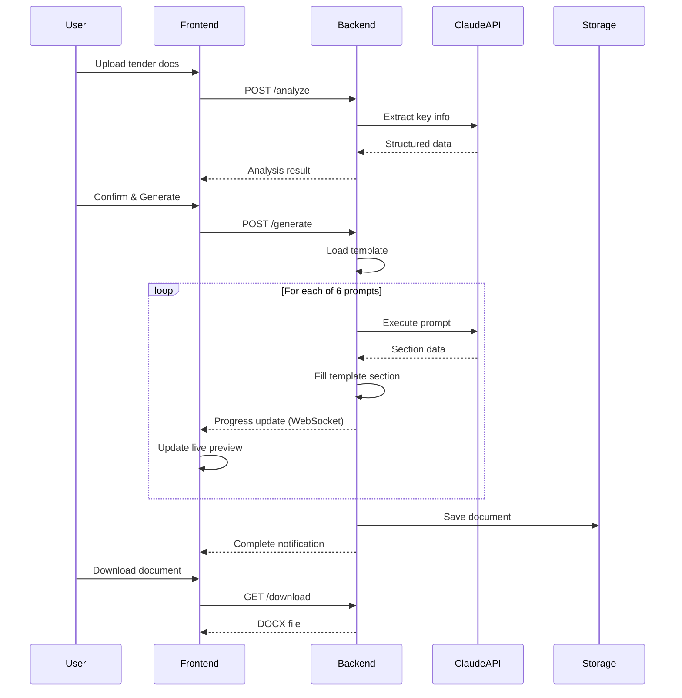

# INSTRUCTIEDOCUMENT: RODE-DRAAD-SESSIE GENERATOR
## Integratie in Tender Planning Tool

**Datum:** 16 januari 2026  
**Versie:** 1.0  
**Status:** Ready for Development

---

## 📋 INHOUDSOPGAVE

1. [Context & Achtergrond](#1-context--achtergrond)
2. [Functionaliteit Overzicht](#2-functionaliteit-overzicht)
3. [Technische Architectuur](#3-technische-architectuur)
4. [Sjabloon Structuur](#4-sjabloon-structuur)
5. [De 6 Prompts (Gedetailleerd)](#5-de-6-prompts-gedetailleerd)
6. [User Flow & UI Specificaties](#6-user-flow--ui-specificaties)
7. [API Specificaties](#7-api-specificaties)
8. [Implementatie Stappenplan](#8-implementatie-stappenplan)
9. [Code Voorbeelden](#9-code-voorbeelden)
10. [Testing & Validatie](#10-testing--validatie)

---

## 1. CONTEXT & ACHTERGROND

### 1.1 Wat is een Rode-draad-sessie Document?

Een **Rode-draad-sessie document** is een centraal werkdocument dat wordt gebruikt bij het voorbereiden van een tender inschrijving. Het document bevat:

- Alle kritieke informatie uit de aanbestedingsdocumenten
- Planning en deadlines (extern en intern)
- Gunningscriteria en beoordelingssystematiek
- Strategische vragen voor kick-off sessies
- Team informatie en verantwoordelijkheden

### 1.2 Waarom Automatiseren?

**Huidige situatie:**
- Handmatig invullen duurt 4-6 uur per tender
- Risico op missende informatie
- Inconsistente kwaliteit

**Na automatisering:**
- Generatie in 5-10 minuten
- Consistente kwaliteit
- Alle kritieke informatie gegarandeerd aanwezig
- Team kan direct aan de slag met strategie

### 1.3 Scope van deze Integratie

**Wat wordt gebouwd:**
Een nieuwe module binnen de bestaande tender planning tool die:
1. Tender documenten analyseert met AI
2. Automatisch een Rode-draad-sessie document genereert
3. Live preview toont tijdens generatie
4. Mogelijkheid biedt voor handmatige correcties
5. Document opslaat in de tool en beschikbaar maakt voor download

**Wat NIET in scope is:**
- Automatische inschrijving schrijven (komt later)
- Prijs calculaties (apart systeem)
- Document collaboration features (aparte feature)

---

## 2. FUNCTIONALITEIT OVERZICHT

### 2.1 Hoofdfunctie

**Naam:** "Genereer Rode-draad-sessie Document"  
**Locatie:** Tender detail pagina, sectie "Documenten"  
**Trigger:** Button click "🎯 Maak Rode-draad-sessie Document"

### 2.2 User Journey

```
Stap 1: Upload & Configuratie (2 min)
├─ Upload tender documenten
├─ Invullen inschrijver info
└─ Klik "Analyseer"

Stap 2: AI Analyse Preview (30 sec)
├─ Review gedetecteerde informatie
├─ Check op missende data
└─ Bevestig of corrigeer

Stap 3: Generatie met Live Preview (5 min)
├─ Zie voortgang per sectie
├─ Bekijk real-time resultaat
└─ Pauzeer indien nodig

Stap 4: Review & Download (2 min)
├─ Quality check resultaten
├─ Handmatige correcties indien nodig
├─ Download definitieve versie
└─ Opslaan in tender dossier
```

### 2.3 Input Requirements

**Verplicht:**
- ✅ Aanbestedingsleidraad (PDF)
- ✅ Bedrijfsnaam inschrijver
- ✅ Minimaal 1 contactpersoon

**Optioneel:**
- Programma van Eisen (PDF)
- Bijlagen gunningscriteria (PDF)
- Historische tender data (voor pre-fill)

### 2.4 Output Specificaties

**Bestandsformaat:** .docx (Microsoft Word)  
**Sjabloon:** `Rode-draad-sessie_-_Sjabloon.docx` (wordt meegeleverd)  
**Bestandsnaam:** `Rode-draad-sessie_[OpdrachtgeverNaam]_[Datum].docx`  
**Opslag locatie:** `/tenders/{tender_id}/documenten/rode-draad-sessie/`

---

## 3. TECHNISCHE ARCHITECTUUR

### 3.1 Component Overzicht

```
┌─────────────────────────────────────────────────────────┐
│                     FRONTEND LAYER                       │
│  ┌──────────────────────────────────────────────────┐  │
│  │  RodeDraadGeneratorModule.jsx                     │  │
│  │  ├─ UploadStep.jsx                                │  │
│  │  ├─ AnalysisPreviewStep.jsx                       │  │
│  │  ├─ GenerationProgressStep.jsx                    │  │
│  │  │  └─ LiveDocumentPreview.jsx                    │  │
│  │  └─ ReviewStep.jsx                                │  │
│  └──────────────────────────────────────────────────┘  │
└─────────────────────────────────────────────────────────┘
                           ↕ API Calls
┌─────────────────────────────────────────────────────────┐
│                     BACKEND LAYER                        │
│  ┌──────────────────────────────────────────────────┐  │
│  │  /api/rode-draad-sessie/                          │  │
│  │  ├─ POST /analyze                                 │  │
│  │  ├─ POST /generate                                │  │
│  │  ├─ GET  /progress/:sessionId                     │  │
│  │  ├─ POST /validate                                │  │
│  │  └─ GET  /download/:documentId                    │  │
│  └──────────────────────────────────────────────────┘  │
│                                                          │
│  ┌──────────────────────────────────────────────────┐  │
│  │  Services                                         │  │
│  │  ├─ TenderAnalyzer.js (PDF extractie)            │  │
│  │  ├─ RodeDraadGenerator.js (orchestrator)         │  │
│  │  ├─ PromptExecutor.js (Claude API calls)         │  │
│  │  ├─ TemplateManager.js (DOCX manipulation)       │  │
│  │  └─ ValidationService.js (quality checks)        │  │
│  └──────────────────────────────────────────────────┘  │
└─────────────────────────────────────────────────────────┘
                           ↕
┌─────────────────────────────────────────────────────────┐
│                   EXTERNAL SERVICES                      │
│  ├─ Claude API (Anthropic)                              │
│  ├─ Database (tender data opslag)                       │
│  └─ File Storage (S3/Azure Blob)                        │
└─────────────────────────────────────────────────────────┘
```

### 3.2 Technology Stack Requirements

**Frontend:**
- React 18+ of Vue 3+
- State management: Redux/Vuex of Context API
- File upload: react-dropzone of vergelijkbaar
- Document preview: react-pdf of mammoth.js

**Backend:**
- Node.js 18+ of Python 3.10+
- Framework: Express.js / FastAPI
- PDF extractie: pdf-parse / PyPDF2
- DOCX manipulatie: docx.js / python-docx
- Queue system: Bull / Celery (voor async processing)

**External:**
- Claude API (Anthropic) - Model: claude-sonnet-4-20250514
- Storage: AWS S3 / Azure Blob Storage
- Database: PostgreSQL / MongoDB

### 3.3 Data Flow



---

## 4. SJABLOON STRUCTUUR

### 4.1 Template Overzicht

Het sjabloon `Rode-draad-sessie_-_Sjabloon.docx` bevat **8 tabellen** die gevuld moeten worden:

| Tabel # | Naam | Rijen | Kolommen | Verantwoordelijke Prompt |
|---------|------|-------|----------|-------------------------|
| 1 | Inschrijver | 4 | 2 | Prompt 1A |
| 2 | Tenderteam | 3 | 2 | Prompt 1A |
| 3 | Document | 3 | 2 | Prompt 1A |
| 4 | Hoofdlijnen | 8 | 2 | Prompt 1B |
| 5 | Gunningscriteria | 5+ | 3 | Prompt 2 |
| 6 | Planning Aanbesteding | 12 | 2 | Prompt 1C |
| 7 | Project Planning | 19 | 3 | Prompt 3 |
| 8 | Kick-off Focus | 8 | 2 | Prompt 4 |

### 4.2 Tabel Structuur Details

#### **Tabel 1: Inschrijver**
```
┌─────────────────────┬──────────────────────────────────┐
│ Label (20% breedte) │ Content (80% breedte)            │
├─────────────────────┼──────────────────────────────────┤
│ Inschrijver         │ [HEADER - merged]                │
├─────────────────────┼──────────────────────────────────┤
│ Bedrijf             │ [Naam, Adres, Telefoon]          │
├─────────────────────┼──────────────────────────────────┤
│ Expertteam          │ [Naam, Functie, Contact] x N     │
│ inschrijver         │                                  │
├─────────────────────┼──────────────────────────────────┤
│ Website             │ [URL]                            │
└─────────────────────┴──────────────────────────────────┘
```

#### **Tabel 4: Hoofdlijnen**
```
┌────────────────────────┬─────────────────────────────┐
│ Hoofdlijnen            │ [HEADER - merged]           │
├────────────────────────┼─────────────────────────────┤
│ Onderwerp              │ [Multi-line description]    │
├────────────────────────┼─────────────────────────────┤
│ Omschrijving opdracht  │ [Detailed scope]            │
├────────────────────────┼─────────────────────────────┤
│ Uitsluitingsgronden en │ [Bulleted list van eisen]   │
│ geschiktheidseisen     │                             │
├────────────────────────┼─────────────────────────────┤
│ Kerncompetenties       │ [Required experience]       │
├────────────────────────┼─────────────────────────────┤
│ Verdeling punten op    │ [K1: X pt, K2: Y pt, etc.]  │
│ kwaliteit              │ [Verhouding prijs/kwaliteit]│
├────────────────────────┼─────────────────────────────┤
│ Eisen vormgeving       │ [Arial, 10pt, marges, etc.] │
├────────────────────────┼─────────────────────────────┤
│ Beoordeling            │ [Criteria & process]        │
└────────────────────────┴─────────────────────────────┘
```

#### **Tabel 5: Gunningscriteria** (Dynamisch)
```
┌──────────┬───────────────────────────┬──────────────┐
│ Criterium│ Omschrijving              │ Opmerking    │
├──────────┼───────────────────────────┼──────────────┤
│ [HEADER - merged across 3 columns]               │
├──────────┼───────────────────────────┼──────────────┤
│ K1       │ [Detailed description]    │ Max X A4     │
│ [Naam]   │ [Requirements]            │ Y punten     │
│          │ [Assessment method]       │ [Notes]      │
├──────────┼───────────────────────────┼──────────────┤
│ K2       │ ...                       │ ...          │
├──────────┼───────────────────────────┼──────────────┤
│ ...      │ (Dynamisch aantal rijen)  │ ...          │
└──────────┴───────────────────────────┴──────────────┘
```

### 4.3 Opmaak Specificaties (BELANGRIJK!)

**Deze opmaak MAG NIET veranderen:**

- **Lettertype:** Arial
- **Tekstgrootte:** 
  - Headers: 20pt
  - Body text: 18pt
- **Marges:** 0.5 inch (720 DXA) aan alle kanten
- **Tabel kolommen:** 20% (label) / 80% (content)
- **Kleuren:**
  - Primair: #1F4788 (donkerblauw)
  - Accent: #E8EEF7 (lichtblauw)
- **Rij hoogte:** Automatisch (geen vaste hoogte)
- **Uitlijning:** Links (geen justify)

---

## 5. DE 6 PROMPTS (GEDETAILLEERD)

Hieronder vind je de 6 prompts die sequentieel uitgevoerd moeten worden. Elke prompt heeft:
- Een duidelijke taak
- Specifieke extractie-instructies
- Output format specificaties
- Validatie criteria

---

### PROMPT 1A: BASISINFORMATIE (Tabellen 1, 2, 3)

**Doel:** Vul de identificatie-informatie in (inschrijver, tenderteam, document info)

**Input data:**
- Bedrijfsinformatie inschrijver (user input)
- Contactpersonen (user input)
- Huidige datum

**Prompt tekst:**

```
Je bent een tender specialist die een Rode-draad-sessie document invult.

TAAK: Vul de eerste drie tabellen in met basisinformatie.

INPUT INFORMATIE:
Bedrijfsnaam: {bedrijfsnaam}
Adres: {adres}
Telefoon: {telefoon}
Website: {website}

Expertteam:
{expertteam_lijst}

Tenderteam:
- Tendermanager: Rick Hartman, rick@tendertaal.nl, 06 139 062 56
- Tenderschrijver: Nathalie Kazdal, nathalie@tendertaal.nl, 06 250 265 98

Datum: {huidige_datum}

INSTRUCTIES:

1. TABEL 1 - INSCHRIJVER:
   Rij 2 (Bedrijf): Formatteer als:
   **{Bedrijfsnaam}, {Adres}, {Telefoon}**
   
   Rij 3 (Expertteam inschrijver): Lijst elk teamlid als:
   {Naam}, {Functie}, {Telefoon}, {Email}
   (Elk teamlid op een nieuwe regel)
   
   Rij 4 (Website): {website_url}

2. TABEL 2 - TENDERTEAM:
   Rij 2: Rick Hartman, rick@tendertaal.nl, 06 139 062 56
   Rij 3: Nathalie Kazdal, nathalie@tendertaal.nl, 06 250 265 98

3. TABEL 3 - DOCUMENT:
   Rij 2 (Opgesteld door): Nathalie Kazdal
   Rij 3 (Datum): {huidige_datum_formatted}

OUTPUT FORMAT:
Geef je antwoord als JSON met deze structuur:
{
  "tabel1_bedrijf": "...",
  "tabel1_expertteam": "...",
  "tabel1_website": "...",
  "tabel2_tendermanager": "...",
  "tabel2_tenderschrijver": "...",
  "tabel3_opgesteld_door": "...",
  "tabel3_datum": "..."
}

BELANGRIJKE REGELS:
- Gebruik ** voor bold formatting waar aangegeven
- Gebruik \n voor nieuwe regels binnen een cel
- Houd de exacte volgorde en formatting aan
- Voeg GEEN extra informatie toe
```

**Validatie criteria:**
- ✅ Alle verplichte velden ingevuld
- ✅ Email adressen zijn valide
- ✅ Telefoonnummers hebben correct format
- ✅ Website URL is compleet (met https://)

**Expected output voorbeeld:**
```json
{
  "tabel1_bedrijf": "**Kisjes Transport & Verhuur, Laan van de Stier 80, 7324 CV Apeldoorn, 055 - 5213161**",
  "tabel1_expertteam": "Gerbrand Oterdoom, directeur/eigenaar sinds 2019, 06-57679204, gerbrand@kisjes.net\nFiona Hamer, Managementassistent, 06-57383400, fiona@kisjes.nl\nRaymond Faijdherbe, Operationeel manager",
  "tabel1_website": "www.kisjes.net",
  "tabel2_tendermanager": "Rick Hartman, rick@tendertaal.nl, 06 139 062 56",
  "tabel2_tenderschrijver": "Nathalie Kazdal, nathalie@tendertaal.nl, 06 250 265 98",
  "tabel3_opgesteld_door": "Nathalie Kazdal",
  "tabel3_datum": "15-01-2026"
}
```

---

### PROMPT 1B: HOOFDLIJNEN (Tabel 4)

**Doel:** Extraheer en vat samen de hoofdlijnen van de aanbesteding

**Input data:**
- Volledige aanbestedingsleidraad (extracted text)
- Programma van Eisen (indien beschikbaar)

**Prompt tekst:**

```
Je bent een tender specialist die kritieke informatie extraheert uit aanbestedingsdocumenten.

TAAK: Analyseer de aanbestedingsdocumenten en vul Tabel 4 (Hoofdlijnen) in met 8 specifieke onderdelen.

INPUT DOCUMENTEN:
{aanbestedingsleidraad_text}

INSTRUCTIES PER VELD:

1. ONDERWERP (500-1000 woorden):
   Beschrijf uitgebreid:
   - Wat is de aard van de opdracht?
   - Wat zijn de hoofddoelstellingen van de opdrachtgever?
   - Is er sprake van percelen/loten? Zo ja, welke?
   - Wat wordt er exact verwacht van de opdrachtnemer?
   - Wat is de looptijd van het contract?
   - Zijn er bijzonderheden of context die relevant zijn?
   
   Zoek in het document naar secties met titels zoals:
   - "Beschrijving opdracht"
   - "Doel van de aanbesteding"
   - "Scope"
   - "Omvang"

2. OMSCHRIJVING OPDRACHT (300-500 woorden):
   Lijst concreet op:
   - Specifieke diensten/werkzaamheden
   - Volumes en aantallen
   - Locaties waar gewerkt wordt
   - Technische specificaties
   - Fasering (indien van toepassing)
   
   Gebruik bullet points voor duidelijkheid.

3. UITSLUITINGSGRONDEN EN GESCHIKTHEIDSEISEN:
   Maak een complete checklist van ALLE vereiste documenten en certificaten:
   - KvK uittreksels
   - Fiscale verklaringen
   - VOG (Verklaring Omtrent Gedrag)
   - Verzekeringen (welke en hoogte dekking?)
   - ISO certificeringen (welke nummers?)
   - VCA certificaten
   - Branche-specifieke certificeringen
   - Accountantsverklaringen
   - Referenties (hoeveel en welke eisen?)
   
   Zoek naar secties:
   - "Geschiktheidseisen"
   - "Minimumeisen"
   - "Uitsluitingsgronden"
   - "Verplichte documenten"
   
   FORMAT: Gebruik - bullets, groepeer logisch

4. KERNCOMPETENTIES:
   Extraheer LETTERLIJK de gestelde ervaringseisen:
   - Minimaal X jaar ervaring met...
   - Minimaal Y vergelijkbare projecten
   - Omvang projecten (budget/volume)
   - Specifieke competenties per criterium
   - Referentie-eisen
   
   Zoek naar secties:
   - "Technische en beroepsbekwaamheid"
   - "Ervaringseisen"
   - "Referentieprojecten"
   - "Minimale capaciteit"

5. VERDELING PUNTEN OP KWALITEIT:
   Extraheer:
   - Verhouding prijs/kwaliteit (bijv. 30/70, 50/50)
   - Lijst van kwaliteitscriteria met punten:
     • K1: [Naam] - X punten
     • K2: [Naam] - Y punten
     • etc.
   - Totaal aantal kwaliteitspunten
   
   Zoek naar:
   - "Gunningscriteria"
   - "Beoordeling"
   - "Puntenverdeling"

6. EISEN VORMGEVING:
   Extraheer EXACT de opgegeven vormvereisten:
   - Lettertype en grootte
   - Marges
   - Regelafstand
   - Maximaal aantal pagina's per criterium
   - Bestandsformaat
   - Paginanummering
   - Eventuele beperkingen
   
   Citeer letterlijk uit het document.

7. BEOORDELING:
   Beschrijf:
   - Wie beoordeelt? (aantal personen, functie)
   - Hoe wordt beoordeeld? (consensus/gemiddelde)
   - Wat betekent "goed" vs "uitstekend"?
   - Zijn er knock-out criteria?
   - Is er een presentatie/demo vereist?
   
   Zoek naar:
   - "Beoordelingscommissie"
   - "Beoordelingsmethodiek"
   - "Wegingsfactoren"

8. BELANGRIJKE OPMERKINGEN:
   Vlag alle kritieke punten:
   - Knock-out criteria
   - SROI eisen
   - Duurzaamheidseisen (ESG)
   - Sociale clausules
   - Specifieke voorwaarden
   - Risico's die opvallen
   
   Begin met ⚠️ voor zeer belangrijke punten.

OUTPUT FORMAT:
Geef je antwoord als JSON:
{
  "onderwerp": "...",
  "omschrijving_opdracht": "...",
  "uitsluitingsgronden": "...",
  "kerncompetenties": "...",
  "verdeling_punten": "...",
  "eisen_vormgeving": "...",
  "beoordeling": "...",
  "belangrijke_opmerkingen": "..."
}

BELANGRIJK:
- Wees volledig en gedetailleerd
- Citeer exact waar nodig (vooral bij vormgeving)
- Gebruik bullet points voor leesbaarheid
- Vlag onduidelijkheden met [ONDUIDELIJK: ...]
- Als informatie ontbreekt: vermeld [NIET GEVONDEN IN DOCUMENT]
- Gebruik \n\n voor paragraaf breaks
- Gebruik \n• voor bullet points
```

**Validatie criteria:**
- ✅ Alle 8 velden zijn ingevuld
- ✅ Minimaal 300 woorden per veld (behalve vormgeving)
- ✅ Gunningscriteria zijn compleet met punten
- ✅ Vormvereisten zijn specifiek (niet generiek)
- ✅ Geen placeholders zoals "TODO" of "..."

---

### PROMPT 1C: PLANNING AANBESTEDENDE DIENST (Tabel 6)

**Doel:** Extraheer alle data en deadlines van de opdrachtgever

**Input data:**
- Aanbestedingsleidraad (planning sectie)

**Prompt tekst:**

```
Je bent een tender specialist die de officiële planning van een aanbesteding extraheert.

TAAK: Vul Tabel 6 (Planning Aanbesteding) met 12 mijlpalen en hun data.

INPUT DOCUMENT:
{aanbestedingsleidraad_text}

INSTRUCTIES:

Zoek in het document naar de volgende data en vul deze in:

1. Publicatie aanbesteding
   - Zoek: "publicatiedatum", "bekendmaking", "verschijningsdatum"
   - Format: DD-MM-YYYY

2. ⚠️ Uiterste datum vragen 1e NvI
   - Zoek: "deadline vragen", "uiterste datum informatieverzoek", "1e nota van inlichtingen"
   - Vaak: X dagen voor indiendeadline
   - Format: DD-MM-YYYY, HH:MM uur

3. Publicatie 1e Nota van Inlichtingen
   - Zoek: "beantwoording vragen", "publicatie antwoorden"
   - Format: DD-MM-YYYY

4. ⚠️ Uiterste datum vragen 2e NvI (indien van toepassing)
   - Niet altijd aanwezig
   - Format: DD-MM-YYYY, HH:MM uur of [N.V.T.]

5. Publicatie 2e Nota van Inlichtingen (indien van toepassing)
   - Format: DD-MM-YYYY of [N.V.T.]

6. ⚠️⚠️ DEADLINE INSCHRIJVING [KRITIEK!]
   - Zoek: "indieningstermijn", "uiterste datum inschrijving", "deadline"
   - Format: DD-MM-YYYY, HH:MM uur
   - VLAG dit als het binnen 4 weken is!

7. Presentaties (alleen top 3)
   - Indien van toepassing bij meerfasen procedure
   - Format: DD-MM-YYYY of [N.V.T.]

8. Mededeling gunningsbeslissing
   - Zoek: "bekendmaking", "uitkomst"
   - Format: "Verwacht [maand] 2026" of specifieke datum

9. Standstill-periode
   - Meestal: "15 kalenderdagen na gunningsbeslissing"
   - Format: beschrijving + data range

10. Definitieve gunning
    - Na standstill periode
    - Format: "Verwacht [maand] 2026"

11. Start overeenkomst
    - Zoek: "ingangsdatum contract", "startdatum werkzaamheden"
    - Format: DD-MM-YYYY of "Verwacht [maand] 2026"

12. Eventuele bijzonderheden
    - Andere relevante mijlpalen
    - Voorlichtingsbijeenkomsten
    - Verplichte locatiebezoeken

EXTRACTIE TIPS:
- Planning staat vaak in: "Hoofdstuk 3", "Procedure", "Tijdlijn", "Planning"
- Let op verschillende tijdzones/tijdsaanduidingen
- Check ook bijlagen voor gedetailleerde planning
- Europese aanbestedingen: minimale termijnen zijn wettelijk vastgelegd

OUTPUT FORMAT:
Geef je antwoord als JSON array met 12 objecten:
[
  {
    "activiteit": "Publicatie aanbesteding",
    "datum": "DD-MM-YYYY"
  },
  {
    "activiteit": "⚠️ Uiterste datum vragen 1e NvI",
    "datum": "DD-MM-YYYY, HH:MM uur"
  },
  ...
]

BELANGRIJK:
- Gebruik exact de activiteitnamen zoals hierboven
- Behoud de ⚠️ symbolen voor kritieke deadlines
- Als datum niet gevonden: gebruik [NOG NIET BEKEND] of [N.V.T.]
- Tijden altijd in 24-uurs formaat
- Vlag onzekere data met "Verwacht: ..."
```

**Validatie criteria:**
- ✅ Alle 12 activiteiten aanwezig
- ✅ Minimaal deadline inschrijving is gevonden
- ✅ Data zijn in correct NL format (DD-MM-YYYY)
- ✅ Kritieke deadlines hebben ⚠️ symbol
- ✅ N.V.T. gebruikt waar relevant

---

### PROMPT 2: GUNNINGSCRITERIA (Tabel 5)

**Doel:** Extraheer alle kwaliteitscriteria met gedetailleerde requirements

**Input data:**
- Aanbestedingsleidraad (gunningscriteria sectie)
- Programma van Eisen

**Prompt tekst:**

```
Je bent een tender specialist die kwaliteitscriteria analyseert voor inschrijvingen.

TAAK: Extraheer ALLE kwaliteitscriteria (K1, K2, K3, etc.) met volledige details en vul deze in als rijen in Tabel 5.

INPUT DOCUMENTEN:
{aanbestedingsleidraad_text}

INSTRUCTIES:

Voor ELK gevonden kwaliteitscriterium (K1, K2, K3, etc.), extraheer:

1. CRITERIUM NAAM & CODE:
   - Code: K1, K2, K3, etc.
   - Volledige naam (bijv. "K1: Plan van aanpak en projectorganisatie")

2. OMSCHRIJVING (zeer gedetailleerd, 300-500 woorden per criterium):
   
   Extraheer en structureer:
   
   a) **Wat wordt gevraagd?**
      - Exacte opdracht/vraag
      - Welk probleem moet opgelost worden?
      - Wat zijn de doelstellingen?
   
   b) **Verplichte onderdelen:**
      - Lijst ALLE verplichte elementen die behandeld moeten worden
      - Gebruik bullets: "- onderdeel 1\n- onderdeel 2"
   
   c) **Beoordelingscriteria:**
      - Waar wordt op gelet?
      - Wat is "goed" vs "uitstekend"?
      - Zijn er SMART eisen?
   
   d) **Specifieke vereisten:**
      - Moet het gekwantificeerd worden?
      - Moeten referenties/voorbeelden gegeven worden?
      - Zijn er technische specificaties?
   
   e) **Link naar andere documenten:**
      - "Zie ook: Programma van Eisen, hoofdstuk X"
      - "Aansluiting vereist op: [document/sectie]"

3. OPMERKING (praktische info):
   
   Vermeld:
   - **Maximaal aantal pagina's:** X A4
   - **Punten:** Y punten (Z% van totaal)
   - **Vormvereisten:** Lettertype, marges, etc.
   - **Bijlagen:** Toegestaan/verplicht?
   - **Demonstratie:** Is een demo/presentatie vereist?
   - **Tijdsduur:** Als presentatie: hoeveel minuten?
   - **Waarschuwingen:** Knock-out criteria, vaak gemaakte fouten

ZOEK IN DOCUMENT NAAR:
- "Gunningscriteria"
- "Kwaliteitscriteria"
- "Beoordeling inschrijving"
- "EMVI criteria" (Economisch Meest Voordelige Inschrijving)
- "Award criteria"
- Vaak in hoofdstuk 4, 5 of 6

LET OP SPECIALE CRITERIA:
- Presentaties (fysiek/online)
- Demo's (software/proces)
- Proefprojecten
- Referentiebezoeken
- Innovatieplannen
- Duurzaamheidsplannen (ESG)
- Social Return (SROI)

OUTPUT FORMAT:
Geef je antwoord als JSON array (1 object per criterium):
[
  {
    "criterium": "K1: [Volledige naam]",
    "omschrijving": "[Gedetailleerde beschrijving, 300-500 woorden]",
    "opmerking": "Max X A4\nY punten\n[Andere praktische info]"
  },
  {
    "criterium": "K2: [Volledige naam]",
    "omschrijving": "...",
    "opmerking": "..."
  }
]

FORMATTING REGELS:
- Gebruik \n\n voor paragraaf breaks
- Gebruik \n• voor bullet points binnen omschrijving
- Gebruik **bold** voor belangrijke termen
- Gebruik ⚠️ voor waarschuwingen in opmerking
- Begin elk onderdeel in omschrijving met een koptekst:
  
  **Wat wordt gevraagd?**\n[tekst]\n\n**Verplichte onderdelen:**\n• [item]\n\n

BELANGRIJK:
- Wees ZEER volledig - dit is wat het team moet uitwerken
- Citeer letterlijk uit het document waar relevant
- Als iets onduidelijk is: markeer met [ONDUIDELIJK: ...]
- Vergeet geen enkel criterium (ook geen sub-criteria)
- Check ook bijlagen voor extra details
```

**Validatie criteria:**
- ✅ Alle K-criteria gevonden (minimaal K1)
- ✅ Elke omschrijving minimaal 300 woorden
- ✅ Punten en max pagina's vermeld in opmerking
- ✅ Structuur consistent per criterium
- ✅ Geen ontbrekende verplichte onderdelen

---

### PROMPT 3: INTERNE PROJECTPLANNING (Tabel 7)

**Doel:** Genereer een realistische interne planning gebaseerd op de tender deadline

**Input data:**
- Deadline inschrijving (uit Prompt 1C)
- Huidige datum

**Prompt tekst:**

```
Je bent een tender projectmanager die een interne planning maakt voor een tendertraject.

TAAK: Maak een realistische projectplanning (Tabel 7) met 19 taken, werkend terug vanaf de deadline.

INPUT INFORMATIE:
- Deadline inschrijving: {deadline_inschrijving}
- Huidige datum: {huidige_datum}
- Beschikbare tijd: {aantal_dagen} werkdagen

STANDAARD TAKEN (19 stuks):

1. Kick-off
2. Vragen stellen (1e ronde)
3. Delen concept versie 1
4. Feedback aanleveren versie 1
5. Feedback sessie versie 1
6. Delen versie 2
7. NvI antwoorden verwerken
8. Feedback aanleveren versie 2
9. Feedback sessie versie 2
10. Delen versie 3
11. Feedback aanleveren versie 3
12. Feedback sessie versie 3 (puntjes op de i)
13. Naar vormgever
14. Delen definitieve versie
15. Evt. laatste feedback
16. Interne deadline indienen (4-ogen principe)
17. Deadline indiening (EXTERN)
18. [Optioneel: Presentatie voorbereiding]
19. [Optioneel: Presentatie]

PLANNING LOGICA:

**Werk vanaf de deadline terug:**

1. **Deadline indiening:** {deadline_inschrijving}
   - Dit is VAST en komt uit het aanbestedingsdocument

2. **Interne deadline:** 2 werkdagen voor externe deadline
   - Buffer voor 4-ogen principe
   - Upload testen, laatste checks

3. **Definitieve versie klaar:** 3 werkdagen voor interne deadline
   - Tijd voor evt. laatste aanpassingen

4. **Naar vormgever:** 2 werkdagen eerder
   - Vormgeving en layout finaliseren

5. **Feedback sessie 3 (puntjes op de i):** 1 werkdag eerder
   - 1-2 uur, kleine correcties

6. **Versie 3 delen:** 3 werkdagen eerder
   - Team leest door (2 dagen feedback tijd)

7. **Feedback sessie 2:** 1 werkdag na versie 2
   - 2 uur sessie, grotere aanpassingen bespreken

8. **Versie 2 delen:** 4 werkdagen eerder
   - Eerste revisie compleet

9. **NvI verwerking:** Tussen versie 1 en 2
   - Check publicatiedatum NvI in planning aanbesteding

10. **Feedback sessie 1:** 1 werkdag na versie 1
    - 2 uur sessie, eerste reacties

11. **Versie 1 delen:** 7-10 werkdagen na kick-off
    - Afhankelijk van complexiteit tender

12. **Vragen stellen:** Binnen 1 week na kick-off
    - Check deadline 1e NvI uit planning aanbesteding

13. **Kick-off:** Zo snel mogelijk na publicatie
    - Bij voorkeur binnen 2-3 werkdagen

REALISME CHECKS:

- **Als totale tijd < 4 weken:** 
  ⚠️ VERKORT SCHEMA - minder feedback rondes
  - Sla versie 3 over
  - Kortere feedback periodes (1 dag i.p.v. 2)

- **Als totale tijd 4-8 weken:**
  ✓ NORMAAL SCHEMA - 3 versies

- **Als totale tijd > 8 weken:**
  ✓ COMFORTABEL SCHEMA
  - Extra tijd voor research
  - Optioneel: extra feedback ronde
  - Meer tijd voor vormgeving

SESSIE TIJDEN (vaste template):
- Kick-off: 2 uur (09:30-11:30 of 14:00-16:00)
- Feedback sessie 1: 2 uur (14:30-16:30)
- Feedback sessie 2: 2 uur (10:00-12:00)
- Feedback sessie 3: 1 uur (09:00-10:00)

WIE DOET WAT:
- Delen concepten: Tenderschrijver
- Feedback aanleveren: Expertteam + Tendermanager
- Feedback sessies: Iedereen
- Vragen stellen: Team (collectief)
- Naar vormgever: Tendermanager + Tenderschrijver
- Indienen: Inschrijver (met check door Tendercoördinator)

OUTPUT FORMAT:
Geef je antwoord als JSON array met 19 objecten:
[
  {
    "taak": "Kick-off",
    "wie": "Expertteam inschrijver, Tenderschrijver, Tendermanager",
    "datum": "DD-MM-YYYY\nHH:MM - HH:MM"
  },
  {
    "taak": "Vragen stellen",
    "wie": "Team",
    "datum": "Uiterlijk DD-MM-YYYY\nHH:MM uur"
  },
  ...
]

BELANGRIJK:
- Alle data op WERKDAGEN (niet weekend)
- Nederlandse feestdagen vermijden
- Check realisme: niet te krap, niet te ruim
- Sessies op standaard tijden (10:00, 14:00, etc.)
- Duidelijk aangeven welke deadlines EXTERN zijn (⚠️)
- Vlag te krappe planning met waarschuwing
- Als presentatie in tender: voeg 2 extra taken toe:
  • Presentatie voorbereiding (3 dagen voor)
  • Presentatie (op datum uit planning aanbesteding)
```

**Validatie criteria:**
- ✅ Alle 19 taken aanwezig (of 17 zonder presentatie)
- ✅ Data lopen logisch op (chronologisch)
- ✅ Externe deadline komt exact overeen met tender
- ✅ Interne deadline 2 dagen voor externe
- ✅ Geen weekends, geen feestdagen
- ✅ Sessies hebben tijd-slots

---

### PROMPT 4: KICK-OFF FOCUS VRAGEN (Tabel 8)

**Doel:** Genereer tender-specifieke strategische vragen voor de kick-off sessie

**Input data:**
- Alle geëxtraheerde informatie uit eerdere prompts
- Type tender (bouw/IT/transport/etc.)
- Opdrachtgever naam
- Complexiteit (simpel/gemiddeld/complex)

**Prompt tekst:**

```
Je bent een strategische tender adviseur die een kick-off sessie voorbereidt.

TAAK: Genereer voor elke van de 7 focus categorieën concrete, tender-specifieke vragen die het tenderteam moet beantwoorden.

INPUT CONTEXT:
Opdrachtgever: {opdrachtgever_naam}
Type tender: {tender_type}
Onderwerp: {onderwerp_samenvatting}
Gunningscriteria: {criteria_lijst}
Complexiteit: {complexiteit_niveau}
Deadline: {deadline_datum} ({aantal_weken} weken)

DE 7 FOCUS CATEGORIEËN:

---

### CATEGORIE 1: VOORAF - ALGEMENE ZAKEN & RANDVOORWAARDEN

Doel: Checken of we überhaupt kunnen/moeten inschrijven

Genereer 8-12 vragen zoals:

**Go/No-Go vragen:**
- Voldoen we aantoonbaar aan alle minimumeisen en knock-out criteria?
- Zijn alle certificaten, verklaringen en referenties beschikbaar en actueel?
- Hebben we voldoende capaciteit (mensen, middelen, tijd)?
- Past deze opdracht bij onze strategie en portfolio?

**Risico & Resource vragen:**
- Welke risico's zien we in deze tender?
- Wat zijn de harde deadlines en interne beslismomenten?
- Welke input is nodig voor {lijst_criteria} en wie levert die?
- Zijn er onderdelen die we moeten inkopen/uitbesteden?

**Aannames & Vragen:**
- Welke aannames doen we nu die nog gevalideerd moeten worden?
- Welke vragen moeten we stellen in de Nota van Inlichtingen?
- Zijn er onduidelijkheden in het bestek die opgehelderd moeten?

**Specifiek voor deze tender:**
[Genereer 2-3 tender-specifieke vragen o.b.v. bijzonderheden]

---

### CATEGORIE 2: BEOORDELINGSLOGICA & DMU-ANALYSE

Doel: Begrijpen wie beslist en hoe ze beoordelen

Genereer 10-15 vragen zoals:

**Beoordelaars identificatie:**
- Weten we wie in de beoordelingscommissie zitten?
- Wat zijn hun achtergronden, rollen en expertise?
- Wie heeft de meeste invloed op de uiteindelijke keuze?
- Kent iemand uit ons team deze mensen al?

**Besluitvormingsproces:**
- Hoe wordt beoordeeld: consensus of gemiddelde scores?
- Welke beoordelaars kijken primair naar {criterium_1}?
- Welke beoordelaars wegen zwaar op {criterium_2}?
- Welke rol speelt {specifiek_aspect} in de beoordeling?

**Scoring psychologie:**
- Hoe zorgen we dat elke beoordelaar individueel tot een "uitstekend" oordeel komt?
- Waar mogen we geen interpretatieruimte laten in de teksten?
- Welke onderdelen zijn consensus-gevoelig en moeten dus extra expliciet?
- Wat zijn veelvoorkomende valkuilen bij dit type tender?

**Opdrachtgever profiel:**
- Wat weten we over de cultuur van {opdrachtgever}?
- Wat zijn hun prioriteiten: kosten, kwaliteit, innovatie, veiligheid?
- Hebben ze eerder vergelijkbare tenders gedaan? Wat kunnen we daarvan leren?
- Waar zijn ze ontevreden over met hun huidige leverancier?

**Specifiek voor deze tender:**
[Genereer 2-3 vragen o.b.v. beoordelingssystematiek]

---

### CATEGORIE 3: KERNBOODSCHAPPEN & WINTHEMA'S

Doel: Bepalen wat ons onderscheidt en memorabel maakt

Genereer 12-18 vragen zoals:

**Memorability:**
- Wat moeten beoordelaars na het lezen onthouden van onze inschrijving?
- Wat is onze "one-liner" voor deze tender?
- Welke 3 kernboodschappen komen in elk criterium terug?

**Onderscheidend vermogen:**
- Op welke thema's willen we aantoonbaar beter zijn dan concurrenten?
- Welke winthema's zijn echt onderscheidend (niet "hygiënefactoren")?
- Wat kunnen wij dat anderen niet kunnen?
- Waar durven we groot te denken?

**Bewijsvoering:**
- Welke beloften durven we SMART te maken en contractueel te borgen?
- Welke KPI's (bijv. {relevante_kpis}) durven we concreet te benoemen?
- Welke bewijslast kunnen we direct tonen (data, processen, systemen)?
- Welke referenties zijn het sterkst voor deze specifieke opdracht?

**Aansluiting op opdrachtgever:**
- Hoe sluiten onze sterke punten aan op de pijnpunten van {opdrachtgever}?
- Wat zijn hun expliciete én impliciete wensen?
- Hoe tonen we begrip van hun context en uitdagingen?

**Specifiek voor criteria:**
Voor {criterium_1}: Wat is onze kernboodschap?
Voor {criterium_2}: Wat is onze kernboodschap?
[etc. voor elk criterium]

**Risico's:**
- Welke kernboodschappen kunnen averechts werken?
- Waar moeten we oppassen met overbeloven?
- Zijn er gevoeligheden bij deze opdrachtgever?

---

### CATEGORIE 4: BEHOEFTEANALYSE OPDRACHTGEVER

Doel: Diep begrip van wat {opdrachtgever} echt nodig heeft

Genereer 10-15 vragen zoals:

**Huidige situatie:**
- Welke operationele problemen ervaart {opdrachtgever} nu?
- Waarom komt deze tender op dit moment?
- Wat ging er mis met de vorige leverancier (indien van toepassing)?
- Waar ontstaan de meeste faalkosten in hun huidige proces?

**Gewenste situatie:**
- Wat betekent "succes" concreet voor {opdrachtgever}?
- Wat is het verschil tussen hun expliciete vraag en onderliggende behoefte?
- Welke KPI's zijn voor hen het belangrijkst?
- Wat betekent "{specifieke_term_uit_tender}" concreet voor hen?

**Verwachtingen:**
- Wat verwacht {opdrachtgever} van een opdrachtnemer naast uitvoering?
- Hoe belangrijk is voorspelbaarheid versus flexibiliteit?
- Welke ambities hebben ze met {specifiek_aspect}?
- Wat moet {specifiek_systeem/proces} voor hen opleveren in de dagelijkse praktijk?

**Context & Druk:**
- Welke externe druk ervaren ze? (politiek, budget, regelgeving)
- Wat zijn hun strategische doelen voor de komende jaren?
- Hoe past deze opdracht in hun grotere plaatje?

**Specifiek voor deze tender:**
[Genereer 3-5 vragen o.b.v. specifieke aspecten zoals "digitalisering", "duurzaamheid", "OTIF doelen", etc.]

---

### CATEGORIE 5: SWOT-ANALYSE (EIGEN ORGANISATIE)

Doel: Eerlijk onze sterke en zwakke punten tegen het licht

Genereer 15-20 vragen zoals:

**Strengths (Sterktes):**
- Waar zijn we aantoonbaar sterk in relatie tot deze specifieke opdracht?
- Welke unieke assets hebben we (kennis, mensen, systemen, processen)?
- Welke recente successen zijn relevant voor deze tender?
- Wat zijn de sterkste referenties die we kunnen inzetten?
- Welke cijfers/data onderbouwen onze kwaliteit?

**Weaknesses (Zwaktes):**
- Waar zitten onze kwetsbaarheden richting de gestelde eisen?
- Welke eisen zijn lastig voor ons en hoe gaan we daarmee om?
- Zijn er gaps in ervaring/capaciteit die we moeten adresseren?
- Waar kunnen concurrenten ons aanvallen?
- Welke eerdere projecten liepen minder goed en waarom?

**Opportunities (Kansen):**
- Waar lopen we risico's of zien we kansen bij het behalen van hoge scores?
- Welke kansen kunnen we benutten om onderscheid te maken?
- Zijn er ontwikkelingen in de markt die ons bevoordelen?
- Kunnen we partnerships/samenwerkingen inzetten?
- Welke innovaties kunnen we showcasen?

**Threats (Bedreigingen):**
- Wat moeten we expliciet managen of mitigeren in de teksten?
- Welke externe factoren kunnen ons dwarszitten?
- Wat zijn de verwachtingen die we niet kunnen waarmaken?
- Waar moeten we realistisch zijn over onze beperkingen?

**Praktische SWOT voor criteria:**
Voor {criterium_1}: Wat zijn onze S/W/O/T?
Voor {criterium_2}: Wat zijn onze S/W/O/T?
[voor elk criterium]

**Meta-vragen:**
- Welke sterke punten zijn niet geschikt om uit te schrijven binnen de A4-beperkingen?
- Hoe maken we zwaktes bespreekbaar zonder ze te accentueren?
- Welke kansen vereisen te veel uitleg en raken we dus kwijt?

---

### CATEGORIE 6: CONCURRENTIEANALYSE

Doel: Weten wie we verslaan en hoe

Genereer 12-15 vragen zoals:

**Concurrent identificatie:**
- Wie zien we als belangrijkste concurrenten voor deze tender?
- Wie is de huidige leverancier (indien van toepassing)?
- Welke partijen schrijven waarschijnlijk in o.b.v. hun portfolio?
- Zijn er verrassende partijen die kunnen inschrijven?

**Concurrent profielen:**
- Wat zijn de sterke punten van {concurrent_1}?
- Waar verwachten we dat {concurrent_2} maximaal op scoort?
- Welke partijen zullen inzetten op prijs, welke op schaal, welke op innovatie?
- Wie heeft de beste referenties bij {opdrachtgever} of vergelijkbare opdrachtgevers?

**Onderscheidende strategie:**
- Waar kunnen wij ons onderscheiden zonder te overbeloven?
- Op welke onderdelen verwachten we dat {opdrachtgever} verschillen gaat zien?
- Waar mogen we niet "gemiddeld" zijn?
- Welke concurrenten moeten we expliciet "verslaan" op specifieke criteria?

**Marktcontext:**
- Wat is de huidige marktdruk in deze sector?
- Zijn er recent vergelijkbare tenders geweest? Wat kunnen we daarvan leren?
- Hoe is de prijsvorming in deze markt momenteel?
- Zijn er schaarsten (mensen, materiaal) die de inschrijving beïnvloeden?

**Specifiek voor deze tender:**
[Genereer 2-3 vragen o.b.v. sector/type tender]

---

### CATEGORIE 7: WINSTSTRATEGIE

Doel: Bepalen hoe we deze tender winnen binnen onze mogelijkheden

Genereer 10-15 vragen zoals:

**Strategische keuzes:**
- Hoe winnen we deze aanbesteding inhoudelijk?
- Waar zetten we bewust zwaar op in en waar niet?
- Wat moet minimaal "goed" scoren en wat moet "uitstekend" zijn?
- Op welke criteria kunnen we maximaal scoren en waar nemen we genoegen met "voldoende"?

**Resource allocatie:**
- Hoeveel uren/budget willen we in deze tender steken?
- Welke expertise moeten we extern inhuren?
- Wie zijn de key players in ons team en hoe verdelen we de taken?
- Welke onderdelen kunnen we hergebruiken van eerdere tenders?

**Risico management:**
- Welke concessies zijn acceptabel en welke niet?
- Waar nemen we bewust risico en waarom?
- Wat is ons "drop-dead" scenario waarbij we stoppen met de inschrijving?
- Hoe gaan we om met onzekerheden in de tender?

**Prijs-kwaliteit balans:**
- Wat is onze prijsstrategie: agressief/competitief/premium?
- Wat is onze fallback-strategie als prijsdruk hoog is?
- Kunnen we met kwaliteit compenseren als we duurder zijn?
- Hoe benutten we de {prijs_kwaliteit_ratio} verhouding optimaal?

**Succes definitie:**
- Wanneer is deze inschrijving voor ons een succes?
- Wat als we niet winnen: wat leren we dan?
- Hoe meten we achteraf of we de juiste keuzes hebben gemaakt?

**Go/No-Go heroverweging:**
- Nu we alle details kennen: schrijven we nog steeds in?
- Zijn er show-stoppers die we over het hoofd hebben gezien?
- Wat is onze win probability realistisch gezien?

**Specifiek voor deze tender:**
[Genereer 2-3 strategische vragen o.b.v. complexiteit/context]

---

OUTPUT FORMAT:

Geef je antwoord als JSON object met 7 categorieën:
{
  "vooraf_algemene_zaken": [
    "Vraag 1?",
    "Vraag 2?",
    ...
  ],
  "beoordelingslogica_dmu": [
    "Vraag 1?",
    ...
  ],
  "kernboodschappen_winthemas": [...],
  "behoefteanalyse": [...],
  "swot_analyse": [...],
  "concurrentieanalyse": [...],
  "winststrategie": [...]
}

BELANGRIJKE REGELS:
1. Alle vragen SPECIFIEK maken voor deze tender (niet generiek)
2. Gebruik concrete namen: {opdrachtgever}, {criterium_naam}, etc.
3. Varieer vraagtypen: open vragen, multiple choice, ja/nee
4. Sommige vragen mogen provocerend/uitdagend zijn
5. Focus op ACTIE: vragen moeten leiden tot beslissingen
6. Vermijd jargon, gebruik heldere taal
7. Groepeer logisch (zie subcategorieën hierboven)
8. Totaal: 70-90 vragen verdeeld over 7 categorieën

KWALITEIT CHECK:
- Kunnen deze vragen beantwoord worden door het team?
- Leiden de antwoorden tot een betere inschrijving?
- Zijn de vragen relevant voor DIT specifieke tender?
- Is er balans tussen strategisch en praktisch?
```

**Validatie criteria:**
- ✅ 7 categorieën aanwezig
- ✅ Minimaal 70 vragen totaal
- ✅ Vragen zijn tender-specifiek (niet generiek)
- ✅ Mix van open en gesloten vragen
- ✅ Namen en criteria uit tender gebruikt

---

## 6. USER FLOW & UI SPECIFICATIES

### 6.1 Scherm 1: Initiatie

**Locatie:** Tender detail pagina → Tab "Documenten"

**Layout:**
```
┌─────────────────────────────────────────────────────────┐
│  📄 Documenten                                          │
├─────────────────────────────────────────────────────────┤
│                                                         │
│  Geüploade Bestanden:                                   │
│  ├─ 📄 Aanbestedingsleidraad.pdf (2.4 MB)             │
│  ├─ 📄 Programma_van_Eisen.pdf (1.8 MB)               │
│  └─ 📄 Bijlage_Gunningscriteria.pdf (0.5 MB)          │
│                                                         │
│  [+ Upload Document]                                    │
│                                                         │
│  ─────────────────────────────────────────────────────  │
│                                                         │
│  ⚡ Snelle Acties                                       │
│                                                         │
│  ┌──────────────────────────────────────────────────┐  │
│  │  🎯 Genereer Rode-draad-sessie Document         │  │
│  │                                                  │  │
│  │  Maak automatisch een compleet Rode-draad-      │  │
│  │  sessie document op basis van de geüploade      │  │
│  │  tender documenten.                              │  │
│  │                                                  │  │
│  │  Geschatte tijd: 5-10 minuten                   │  │
│  │                                                  │  │
│  │          [🚀 Start Generatie →]                  │  │
│  └──────────────────────────────────────────────────┘  │
│                                                         │
│  Eerder gegenereerde documenten:                        │
│  ├─ 📋 Rode-draad-sessie_v1.docx (12-01-2026)         │
│  │    [👁 Bekijk] [📥 Download]                        │
│  └─ (geen)                                             │
│                                                         │
└─────────────────────────────────────────────────────────┘
```

**Interactie:**
- Button "Start Generatie" klikt door naar Scherm 2
- Als er geen documenten zijn geüpload: Toon warning message

---

### 6.2 Scherm 2: Configuratie

**Titel:** "Rode-draad-sessie Generatie - Stap 1 van 4"

**Layout:**
```
┌─────────────────────────────────────────────────────────┐
│  ← Terug                  Stap 1: Configuratie          │
│                                                         │
│  ●━━━━○━━━━○━━━━○  (progress bar: 25%)                 │
│  Config → Analyse → Genereer → Review                   │
│                                                         │
├─────────────────────────────────────────────────────────┤
│                                                         │
│  📤 Geüploade Documenten                                │
│  ✅ Aanbestedingsleidraad.pdf                          │
│  ✅ Programma_van_Eisen.pdf                            │
│  ✅ Bijlage_Gunningscriteria.pdf                        │
│                                                         │
│  ─────────────────────────────────────────────────────  │
│                                                         │
│  👤 Inschrijver Informatie                              │
│                                                         │
│  Bedrijfsnaam *                                         │
│  [__________________________]                           │
│                                                         │
│  Adres *                                                │
│  [__________________________]                           │
│                                                         │
│  Telefoon *                                             │
│  [__________________________]                           │
│                                                         │
│  Website                                                │
│  [__________________________]                           │
│                                                         │
│  ─────────────────────────────────────────────────────  │
│                                                         │
│  👥 Expertteam Inschrijver                              │
│                                                         │
│  ┌──────────────────────────────────────────────────┐  │
│  │ Naam:     [_____________________]                │  │
│  │ Functie:  [_____________________]                │  │
│  │ Telefoon: [_____________________]                │  │
│  │ Email:    [_____________________]                │  │
│  │                                   [❌ Verwijder]  │  │
│  └──────────────────────────────────────────────────┘  │
│                                                         │
│  [+ Voeg Teamlid Toe]                                   │
│                                                         │
│  ─────────────────────────────────────────────────────  │
│                                                         │
│  ℹ️ Het tenderteam (Rick & Nathalie) wordt automatisch │
│     ingevuld.                                           │
│                                                         │
│                                                         │
│  [Annuleer]              [Volgende: Analyseren →]       │
│                                                         │
└─────────────────────────────────────────────────────────┘
```

**Validatie:**
- Bedrijfsnaam verplicht (min 2 karakters)
- Adres verplicht
- Telefoon verplicht (format check)
- Email check bij teamleden
- Minimaal 1 teamlid vereist

**Interactie:**
- "Volgende" klikt door naar Scherm 3
- Data wordt opgeslagen in sessie/database

---

### 6.3 Scherm 3: AI Analyse Preview

**Titel:** "Rode-draad-sessie Generatie - Stap 2 van 4"

**Layout:**
```
┌─────────────────────────────────────────────────────────┐
│  ← Terug                   Stap 2: Analyse              │
│                                                         │
│  ●━━━━●━━━━○━━━━○  (progress bar: 50%)                 │
│  Config → Analyse → Genereer → Review                   │
│                                                         │
├─────────────────────────────────────────────────────────┤
│                                                         │
│  🤖 AI Documentanalyse                                  │
│                                                         │
│  [Bezig met analyseren...]  (of resultaat hieronder)    │
│                                                         │
│  ✅ RESULTATEN                                          │
│                                                         │
│  📋 Tender Identificatie                                │
│  ├─ Type: Europese Openbare Aanbesteding              │
│  ├─ Opdrachtgever: Gemeente Lelystad                  │
│  ├─ TenderNed: 543510                                  │
│  └─ Publicatie: 18-11-2025                             │
│                                                         │
│  📅 Kritieke Deadlines                                  │
│  ├─ ⚠️ Vragen 1e NvI: 09-12-2025, 09:00              │
│  ├─ Publicatie NvI: 16-12-2025                         │
│  ├─ ⚠️⚠️ DEADLINE: 05-02-2026, 09:00                │
│  │    └─ [Nog 21 dagen] ⏰                             │
│  └─ Gunning verwacht: Maart 2026                       │
│                                                         │
│  📊 Gunningscriteria                                    │
│  ├─ Verhouding: 50% Prijs / 50% Kwaliteit             │
│  ├─ K1: Plan van aanpak (20 pt, max 4 A4)             │
│  ├─ K1A: Kwaliteit (10 pt, max 2 A4)                   │
│  └─ K2: Presentatie (20 pt, 60 min)                    │
│                                                         │
│  ⚠️ Belangrijke Aandachtspunten                        │
│  ├─ Knock-out: Incomplete inschrijving                │
│  ├─ Knockout: Niet voldoen aan minimumeisen           │
│  ├─ SROI: 5% van contractwaarde                        │
│  └─ ESG: Duurzaamheidsplan vereist                     │
│                                                         │
│  📦 Percelen/Loten                                      │
│  └─ Enkelvoudige opdracht (geen percelen)             │
│                                                         │
│  ─────────────────────────────────────────────────────  │
│                                                         │
│  ℹ️ Controle Checklist                                 │
│  □ Klopt de opdrachtgever?                             │
│  □ Is de deadline correct?                              │
│  □ Zijn alle criteria gevonden?                        │
│  □ Zijn de aandachtspunten compleet?                   │
│                                                         │
│  ⚠️ Opmerking: Deadline is over 3 weken - verkort      │
│     schema aanbevolen (minder feedback rondes).         │
│                                                         │
│                                                         │
│  [← Terug naar Config]     [Genereer Document →]        │
│                                                         │
└─────────────────────────────────────────────────────────┘
```

**Backend proces tijdens dit scherm:**
1. PDF's worden geparsed (pdf-parse/PyPDF2)
2. Claude API call met analyse prompt
3. Structured data extractie
4. Validatie en formatting
5. Presentatie in UI

**Loading state:**
- Spinner met tekst "Analyseren van documenten..."
- Progress indicator voor elke stap

**Interactie:**
- "Terug" gaat naar Scherm 2 (config kan worden aangepast)
- "Genereer Document" start daadwerkelijke generatie (Scherm 4)

---

### 6.4 Scherm 4: Generatie met Live Preview

**Titel:** "Rode-draad-sessie Generatie - Stap 3 van 4"

**Layout (Split screen):**
```
┌──────────────────────────────────────────────────────────┐
│  Stap 3: Genereren                               [X Stop] │
│                                                           │
│  ●━━━━●━━━━●━━━━○  (progress bar: 75%)                   │
│  Config → Analyse → Genereer → Review                     │
│                                                           │
├────────────────────┬──────────────────────────────────────┤
│                    │                                      │
│  📋 Voortgang      │  👁 Live Preview                     │
│                    │                                      │
│  ✅ Inschrijver    │  ┌────────────────────────────────┐ │
│  ✅ Tenderteam     │  │ RODE-DRAAD-SESSIE              │ │
│  ✅ Document info  │  │                                │ │
│  ✅ Hoofdlijnen    │  │ Gemeente Lelystad              │ │
│  🔄 Gunningscrit.  │  │ Bouwkundige werkzaamheden      │ │
│     (2/3)          │  │                                │ │
│  ⏳ Planning       │  ├────────────────────────────────┤ │
│  ⏳ Interne plan.  │  │ # Inschrijver                  │ │
│  ⏳ Kick-off       │  │                                │ │
│                    │  │ Bedrijf:                       │ │
│  ─────────────     │  │ [Company name], ...            │ │
│                    │  │                                │ │
│  📊 Details        │  │ Expertteam:                    │ │
│                    │  │ • Person 1, Function, ...      │ │
│  Huidige sectie:   │  │ • Person 2, Function, ...      │ │
│  "K2 - Presentatie"│  │                                │ │
│                    │  ├────────────────────────────────┤ │
│  Geschatte tijd:   │  │ # Hoofdlijnen                  │ │
│  Nog ~3 minuten    │  │                                │ │
│                    │  │ Onderwerp:                     │ │
│  ─────────────     │  │ [Generated text appears here   │ │
│                    │  │  as it's being created...]     │ │
│  [⏸ Pauzeer]       │  │                                │ │
│  [⏹ Stop]          │  └────────────────────────────────┘ │
│                    │                                      │
│                    │  [⬆ Scroll om voortgang te zien]     │
│                    │  [📥 Download concept] (beschikbaar  │
│                    │      na voltooiing eerste versie)    │
│                    │                                      │
└────────────────────┴──────────────────────────────────────┘
```

**Functionele eisen:**

1. **Real-time updates:**
   - WebSocket verbinding voor live updates
   - Elke 2-3 seconden nieuwe data
   - Smooth scroll in preview pane

2. **Pause/Resume:**
   - Gebruiker kan proces pauzeren
   - Status wordt bewaard
   - Hervatten op exact dezelfde plek

3. **Error handling:**
   - Als een prompt faalt: retry automatisch (max 3x)
   - Bij persistente fout: toon error + optie om over te slaan
   - Log wordt bijgehouden voor debugging

4. **Progress tracking:**
   - Checkmarks (✅) voor complete secties
   - Spinner (🔄) voor actieve sectie
   - Clock (⏳) voor nog niet gestart
   - Percentage progress per sectie (optioneel)

**Backend process:**
```javascript
// Pseudocode voor backend
async function generateDocument(sessionId) {
  const prompts = [
    { id: 1, name: 'Inschrijver', tables: [1,2,3] },
    { id: 2, name: 'Hoofdlijnen', tables: [4] },
    { id: 3, name: 'Planning', tables: [6] },
    { id: 4, name: 'Gunningscriteria', tables: [5] },
    { id: 5, name: 'Interne planning', tables: [7] },
    { id: 6, name: 'Kick-off vragen', tables: [8] }
  ];
  
  for (const prompt of prompts) {
    // Update status naar "in progress"
    await updateProgress(sessionId, prompt.id, 'in_progress');
    
    try {
      // Execute prompt via Claude API
      const result = await executePrompt(prompt);
      
      // Fill template tables
      await fillTables(template, prompt.tables, result);
      
      // Send live preview update via WebSocket
      await sendPreviewUpdate(sessionId, template);
      
      // Mark as complete
      await updateProgress(sessionId, prompt.id, 'complete');
      
    } catch (error) {
      // Retry logic
      for (let i = 0; i < 3; i++) {
        try {
          const result = await executePrompt(prompt);
          await fillTables(template, prompt.tables, result);
          break;
        } catch (retryError) {
          if (i === 2) {
            // Max retries reached
            await updateProgress(sessionId, prompt.id, 'failed');
            await notifyUser(sessionId, `Sectie ${prompt.name} gefaald`);
          }
        }
      }
    }
  }
  
  // All done
  await finalizeDocument(sessionId);
}
```

---

### 6.5 Scherm 5: Review & Download

**Titel:** "Rode-draad-sessie Generatie - Stap 4 van 4"

**Layout:**
```
┌─────────────────────────────────────────────────────────┐
│                    Stap 4: Review                       │
│                                                         │
│  ●━━━━●━━━━●━━━━●  (progress bar: 100%)                │
│  Config → Analyse → Genereer → Review                   │
│                                                         │
├─────────────────────────────────────────────────────────┤
│                                                         │
│  ✅ Document Succesvol Gegenereerd!                     │
│                                                         │
│  📄 Rode-draad-sessie_Gemeente_Lelystad_16-01-2026.docx │
│                                                         │
│  ─────────────────────────────────────────────────────  │
│                                                         │
│  📊 Kwaliteitscheck                                     │
│                                                         │
│  ✅ Alle 8 tabellen ingevuld                            │
│  ✅ Inschrijver informatie compleet                     │
│  ✅ Hoofdlijnen volledig (8/8 velden)                   │
│  ✅ Gunningscriteria gedetailleerd (3 criteria)         │
│  ⚠️ Planning: Controleer interne deadlines             │
│  ✅ Kick-off vragen specifiek (78 vragen)               │
│  ✅ Opmaak correct (Arial, marges, kleuren)             │
│                                                         │
│  ─────────────────────────────────────────────────────  │
│                                                         │
│  💡 Aanbevelingen                                       │
│                                                         │
│  1. ⚠️ Verkort schema: Slechts 3 weken tot deadline    │
│     → Overweeg 2 i.p.v. 3 feedback rondes              │
│                                                         │
│  2. ℹ️ K2 Presentatie: Bereid dit zo snel mogelijk voor │
│                                                         │
│  3. ✅ Sterke referenties vereist - check beschikbaar-  │
│     heid referenties uit Kerncompetentie 2              │
│                                                         │
│  ─────────────────────────────────────────────────────  │
│                                                         │
│  📥 Acties                                              │
│                                                         │
│  [👁 Preview Document] [💾 Download DOCX]               │
│                                                         │
│  [📝 Handmatig Bewerken]  ← Opent document in editor    │
│                                                         │
│  [📧 Deel met Team]  ← Email naar expertteam           │
│                                                         │
│  [💾 Opslaan in Tender Dossier]  ← Koppel aan tender   │
│                                                         │
│  ─────────────────────────────────────────────────────  │
│                                                         │
│  🔄 Opnieuw Genereren                                   │
│                                                         │
│  Als je niet tevreden bent met het resultaat:           │
│  [← Terug naar Configuratie]                            │
│                                                         │
│  ─────────────────────────────────────────────────────  │
│                                                         │
│  [✅ Klaar - Sluit Wizard]                              │
│                                                         │
└─────────────────────────────────────────────────────────┘
```

**Interacties:**

1. **Preview Document:**
   - Opens modal met inline document viewer (mammoth.js)
   - Scroll through entire document
   - Optie om naar edit mode te gaan

2. **Download DOCX:**
   - Direct download trigger
   - Bestandsnaam: `Rode-draad-sessie_{Opdrachtgever}_{Datum}.docx`

3. **Handmatig Bewerken:**
   - Opens embedded editor (bijv. OnlyOffice/Google Docs alike)
   - Of: Download met instructie om in Word te openen

4. **Deel met Team:**
   - Email compose modal
   - Pre-filled recipients (expertteam members)
   - Attach document + link naar tender in tool

5. **Opslaan in Tender Dossier:**
   - Document wordt gekoppeld aan tender record in database
   - Versioning: v1, v2, etc. als opnieuw gegenereerd
   - Accessible via tender detail pagina

**Validatie & Warnings:**
- Als bepaalde secties leeg zijn → waarschuwing
- Als deadline < 4 weken → extra prominent warning
- Als geen referenties gevonden → actie item

---

## 7. API SPECIFICATIES

### 7.1 Endpoints

#### **POST /api/rode-draad-sessie/analyze**

**Doel:** Analyseer tender documenten en extraheer key informatie

**Request:**
```json
{
  "tender_id": "12345",
  "documents": [
    {
      "type": "aanbestedingsleidraad",
      "file_id": "doc_abc123",
      "filename": "Aanbestedingsleidraad.pdf"
    },
    {
      "type": "programma_van_eisen",
      "file_id": "doc_def456",
      "filename": "PvE.pdf"
    }
  ]
}
```

**Response:**
```json
{
  "analysis_id": "analysis_xyz789",
  "status": "completed",
  "data": {
    "tender_type": "Europese Openbare Aanbesteding",
    "opdrachtgever": "Gemeente Lelystad",
    "tendernet_id": "543510",
    "publicatie_datum": "2025-11-18",
    "deadlines": {
      "vragen_nvi_1": "2025-12-09T09:00:00Z",
      "publicatie_nvi_1": "2025-12-16",
      "inschrijving": "2026-02-05T09:00:00Z",
      "gunning_verwacht": "2026-03"
    },
    "gunningscriteria": {
      "verhouding": "50/50",
      "prijs_percentage": 50,
      "kwaliteit_percentage": 50,
      "criteria": [
        {
          "code": "K1",
          "naam": "Plan van aanpak",
          "punten": 20,
          "max_paginas": 4
        },
        {
          "code": "K1A",
          "naam": "Kwaliteit dienstverlening",
          "punten": 10,
          "max_paginas": 2
        },
        {
          "code": "K2",
          "naam": "Presentatie",
          "punten": 20,
          "duur_minuten": 60
        }
      ]
    },
    "aandachtspunten": [
      {
        "type": "knockout",
        "tekst": "Incomplete inschrijving"
      },
      {
        "type": "requirement",
        "tekst": "SROI: 5% van contractwaarde"
      }
    ],
    "percelen": null,
    "warnings": [
      "Deadline is over 3 weken - verkort schema aanbevolen"
    ]
  },
  "extraction_time_seconds": 45
}
```

**Error Responses:**
```json
{
  "error": "document_parse_failed",
  "message": "Could not extract text from PDF",
  "details": {
    "file_id": "doc_abc123",
    "error_detail": "PDF is encrypted"
  }
}
```

---

#### **POST /api/rode-draad-sessie/generate**

**Doel:** Start document generatie proces

**Request:**
```json
{
  "tender_id": "12345",
  "analysis_id": "analysis_xyz789",
  "inschrijver": {
    "bedrijf": "Kisjes Transport & Verhuur",
    "adres": "Laan van de Stier 80, 7324 CV Apeldoorn",
    "telefoon": "055 - 5213161",
    "website": "www.kisjes.net",
    "expertteam": [
      {
        "naam": "Gerbrand Oterdoom",
        "functie": "Directeur/Eigenaar",
        "telefoon": "06-57679204",
        "email": "gerbrand@kisjes.net"
      }
    ]
  },
  "options": {
    "enable_live_preview": true,
    "skip_sections": []  // Optional: ["kick_off_vragen"] om secties over te slaan
  }
}
```

**Response:**
```json
{
  "session_id": "gen_session_123abc",
  "status": "started",
  "websocket_url": "wss://api.example.com/ws/rode-draad-sessie/gen_session_123abc",
  "estimated_duration_minutes": 8,
  "stages": [
    {
      "stage_id": "stage_1",
      "name": "Inschrijver informatie",
      "status": "pending"
    },
    {
      "stage_id": "stage_2",
      "name": "Hoofdlijnen",
      "status": "pending"
    }
    // ... meer stages
  ]
}
```

**WebSocket Messages (Real-time updates):**

```json
// Progress update
{
  "type": "progress",
  "session_id": "gen_session_123abc",
  "stage_id": "stage_2",
  "status": "in_progress",
  "percentage": 35,
  "message": "Bezig met extraheren hoofdlijnen..."
}

// Section completed
{
  "type": "section_complete",
  "session_id": "gen_session_123abc",
  "stage_id": "stage_2",
  "status": "complete",
  "percentage": 50,
  "preview_data": {
    "tabel_4_onderwerp": "Leveren van bouwkundige werkzaamheden...",
    "tabel_4_omschrijving": "..."
  }
}

// Error occurred
{
  "type": "error",
  "session_id": "gen_session_123abc",
  "stage_id": "stage_5",
  "status": "failed",
  "error": "claude_api_timeout",
  "message": "Claude API reageerde niet binnen 30 seconden",
  "retry_available": true
}

// Final completion
{
  "type": "complete",
  "session_id": "gen_session_123abc",
  "status": "completed",
  "document_id": "doc_final_xyz456",
  "download_url": "/api/rode-draad-sessie/download/doc_final_xyz456"
}
```

---

#### **GET /api/rode-draad-sessie/progress/:sessionId**

**Doel:** Ophalen huidige status (voor polling als WebSocket niet werkt)

**Response:**
```json
{
  "session_id": "gen_session_123abc",
  "status": "in_progress",
  "percentage": 65,
  "current_stage": "stage_5",
  "stages": [
    {
      "stage_id": "stage_1",
      "name": "Inschrijver informatie",
      "status": "complete",
      "completed_at": "2026-01-16T10:15:30Z"
    },
    {
      "stage_id": "stage_5",
      "name": "Interne planning",
      "status": "in_progress",
      "started_at": "2026-01-16T10:18:45Z"
    }
  ],
  "estimated_completion_at": "2026-01-16T10:22:00Z"
}
```

---

#### **POST /api/rode-draad-sessie/validate**

**Doel:** Valideer gegenereerd document voor kwaliteit

**Request:**
```json
{
  "document_id": "doc_final_xyz456"
}
```

**Response:**
```json
{
  "document_id": "doc_final_xyz456",
  "validation_status": "passed_with_warnings",
  "checks": [
    {
      "check_id": "all_tables_filled",
      "name": "Alle tabellen ingevuld",
      "status": "passed",
      "details": "8/8 tabellen compleet"
    },
    {
      "check_id": "word_count_criteria",
      "name": "Minimale woordaantallen",
      "status": "passed",
      "details": "Alle secties voldoen aan minimum"
    },
    {
      "check_id": "deadline_realistic",
      "name": "Realistische planning",
      "status": "warning",
      "details": "Deadline over 3 weken - verkort schema aanbevolen",
      "severity": "medium"
    },
    {
      "check_id": "references_found",
      "name": "Referentie-eisen aanwezig",
      "status": "passed",
      "details": "Kerncompetenties bevatten referentie-eisen"
    }
  ],
  "quality_score": 92,
  "recommendations": [
    "Controleer interne planning handmatig gezien korte deadline",
    "Verifieer dat alle gunningscriteria compleet zijn",
    "Check of SROI-eisen voldoende zijn toegelicht"
  ]
}
```

---

#### **GET /api/rode-draad-sessie/download/:documentId**

**Doel:** Download definitief document

**Response:**
- Headers: `Content-Type: application/vnd.openxmlformats-officedocument.wordprocessingml.document`
- Body: Binary DOCX bestand
- Filename in header: `Content-Disposition: attachment; filename="Rode-draad-sessie_Gemeente_Lelystad_16-01-2026.docx"`

---

#### **POST /api/rode-draad-sessie/retry-section**

**Doel:** Herstart een gefaalde sectie

**Request:**
```json
{
  "session_id": "gen_session_123abc",
  "stage_id": "stage_5"
}
```

**Response:**
```json
{
  "session_id": "gen_session_123abc",
  "stage_id": "stage_5",
  "status": "retrying",
  "attempt": 2,
  "max_attempts": 3
}
```

---

### 7.2 Database Schema

#### **Table: rode_draad_sessions**
```sql
CREATE TABLE rode_draad_sessions (
  id UUID PRIMARY KEY,
  tender_id INT REFERENCES tenders(id),
  analysis_id UUID,
  status VARCHAR(50), -- 'pending', 'in_progress', 'completed', 'failed'
  percentage INT DEFAULT 0,
  current_stage VARCHAR(100),
  error_message TEXT,
  
  -- Input data
  inschrijver_data JSONB,
  options JSONB,
  
  -- Output
  document_id UUID,
  document_url TEXT,
  
  -- Metadata
  created_at TIMESTAMP DEFAULT NOW(),
  updated_at TIMESTAMP DEFAULT NOW(),
  completed_at TIMESTAMP,
  
  INDEX idx_tender (tender_id),
  INDEX idx_status (status)
);
```

#### **Table: rode_draad_stages**
```sql
CREATE TABLE rode_draad_stages (
  id UUID PRIMARY KEY,
  session_id UUID REFERENCES rode_draad_sessions(id),
  stage_number INT,
  stage_name VARCHAR(100),
  status VARCHAR(50), -- 'pending', 'in_progress', 'complete', 'failed'
  
  -- Prompt & response
  prompt_used TEXT,
  claude_response JSONB,
  
  -- Timing
  started_at TIMESTAMP,
  completed_at TIMESTAMP,
  duration_seconds INT,
  
  -- Retry info
  attempt_number INT DEFAULT 1,
  error_message TEXT,
  
  INDEX idx_session (session_id),
  INDEX idx_status (status)
);
```

#### **Table: rode_draad_documents**
```sql
CREATE TABLE rode_draad_documents (
  id UUID PRIMARY KEY,
  session_id UUID REFERENCES rode_draad_sessions(id),
  tender_id INT REFERENCES tenders(id),
  
  -- File info
  filename VARCHAR(255),
  file_path TEXT,
  file_size_bytes BIGINT,
  
  -- Validation
  validation_status VARCHAR(50),
  quality_score INT,
  validation_results JSONB,
  
  -- Versioning
  version INT DEFAULT 1,
  is_latest BOOLEAN DEFAULT true,
  
  -- Metadata
  created_at TIMESTAMP DEFAULT NOW(),
  created_by INT REFERENCES users(id),
  
  INDEX idx_tender (tender_id),
  INDEX idx_session (session_id)
);
```

---

## 8. IMPLEMENTATIE STAPPENPLAN

### Week 1: Foundation

**Dag 1-2: Setup & Dependencies**
- [ ] Project structure opzetten
- [ ] Dependencies installeren:
  - `docx` of `python-docx` voor template manipulation
  - `pdf-parse` of `PyPDF2` voor PDF extractie
  - `@anthropic-ai/sdk` voor Claude API
  - WebSocket library (socket.io / channels)
- [ ] Database schema implementeren
- [ ] Sjabloon uploaden naar repository

**Dag 3-4: Prompt Development**
- [ ] Alle 6 prompts uitschrijven en testen individueel
- [ ] Test met voorbeelddocument (Gemeente Lelystad)
- [ ] Validatie functies per prompt
- [ ] Error handling per prompt

**Dag 5: Template Engine**
- [ ] Template loader bouwen
- [ ] Functie: vul tabel 1, 2, 3, etc.
- [ ] Opmaak behouden (Arial, kleuren, marges)
- [ ] Test met dummy data

---

### Week 2: Core Generator

**Dag 6-7: Document Analyzer**
- [ ] PDF text extractie
- [ ] Structured data extractie met Claude
- [ ] Analyse preview endpoint
- [ ] Validatie extracted data

**Dag 8-10: Sequential Generator**
- [ ] Orchestrator class: RodeDraadGenerator
- [ ] Sequentieel prompts uitvoeren
- [ ] Template vullen per sectie
- [ ] Progress tracking in database

**Dag 11-12: API Endpoints**
- [ ] POST /analyze implementeren
- [ ] POST /generate implementeren
- [ ] GET /progress implementeren
- [ ] Error handling & retry logic

---

### Week 3: Real-time & UI

**Dag 13-14: WebSocket Implementation**
- [ ] WebSocket server setup
- [ ] Real-time progress updates
- [ ] Preview data streaming
- [ ] Connection management

**Dag 15-17: Frontend Components**
- [ ] Scherm 1: Initiatie button
- [ ] Scherm 2: Configuratie form
- [ ] Scherm 3: Analyse preview
- [ ] Scherm 4: Generatie met live preview (split screen)
- [ ] Scherm 5: Review & download

**Dag 18-19: Integration**
- [ ] Frontend <-> Backend verbinding
- [ ] State management (Redux/Vuex)
- [ ] Error handling UI
- [ ] Loading states & spinners

---

### Week 4: Quality & Testing

**Dag 20-21: Validation Service**
- [ ] POST /validate endpoint
- [ ] Quality checks implementeren
- [ ] Recommendations engine
- [ ] Automated tests

**Dag 22-23: Testing**
- [ ] Unit tests voor elke prompt
- [ ] Integration tests voor hele flow
- [ ] End-to-end test met echte tender
- [ ] Performance testing (tijd metingen)

**Dag 24-25: Polish & Documentation**
- [ ] User guide schrijven
- [ ] API documentatie (Swagger/OpenAPI)
- [ ] Inline code comments
- [ ] Error messages gebruiksvriendelijk maken

---

### Week 5: Launch Prep

**Dag 26-27: Beta Testing**
- [ ] 3-5 beta gebruikers testen laten doen
- [ ] Feedback verwerken
- [ ] Bug fixes
- [ ] Performance optimalisaties

**Dag 28: Deploy**
- [ ] Production deployment
- [ ] Monitoring setup (Sentry, Datadog)
- [ ] Backup strategie
- [ ] Rollback plan

**Dag 29-30: Launch & Support**
- [ ] Feature announcement
- [ ] Training sessie voor team
- [ ] Support kanaal opzetten
- [ ] Eerste gebruikers begeleiden

---

## 9. CODE VOORBEELDEN

### 9.1 Template Manager (Node.js)

```javascript
// services/TemplateManager.js

const docx = require('docx');
const fs = require('fs').promises;

class TemplateManager {
  constructor(templatePath) {
    this.templatePath = templatePath;
    this.document = null;
  }

  async load() {
    const content = await fs.readFile(this.templatePath);
    this.document = await docx.Document.load(content);
    return this;
  }

  /**
   * Fill a specific cell in a table
   * @param {number} tableIndex - 0-based index of table in document
   * @param {number} rowIndex - 0-based row index
   * @param {number} cellIndex - 0-based cell index
   * @param {string} content - Text content to insert
   */
  fillCell(tableIndex, rowIndex, cellIndex, content) {
    if (!this.document) {
      throw new Error('Document not loaded. Call load() first.');
    }

    const table = this.document.getBody().getSectionChildren()[tableIndex];
    if (!table || table.type !== 'table') {
      throw new Error(`No table found at index ${tableIndex}`);
    }

    const row = table.getChildren()[rowIndex];
    if (!row) {
      throw new Error(`No row found at index ${rowIndex}`);
    }

    const cell = row.getChildren()[cellIndex];
    if (!cell) {
      throw new Error(`No cell found at index ${cellIndex}`);
    }

    // Clear existing content
    cell.clear();

    // Add new paragraphs (support for \n newlines)
    const lines = content.split('\n');
    lines.forEach((line, idx) => {
      const paragraph = new docx.Paragraph({
        children: [
          new docx.TextRun({
            text: line,
            font: 'Arial',
            size: 18 * 2, // Half-points (18pt = 36)
          })
        ],
        spacing: {
          before: idx === 0 ? 0 : 120, // 120 = 0.15 inch
          after: 120
        }
      });
      cell.addChildElement(paragraph);
    });
  }

  /**
   * Fill Table 1: Inschrijver
   */
  async fillTable1(data) {
    // Row 2: Bedrijf
    this.fillCell(0, 1, 1, data.bedrijf);

    // Row 3: Expertteam
    this.fillCell(0, 2, 1, data.expertteam);

    // Row 4: Website
    this.fillCell(0, 3, 1, data.website);
  }

  /**
   * Fill Table 4: Hoofdlijnen
   */
  async fillTable4(data) {
    const tableIndex = 3; // 4th table (0-indexed)

    this.fillCell(tableIndex, 1, 1, data.onderwerp);
    this.fillCell(tableIndex, 2, 1, data.omschrijving_opdracht);
    this.fillCell(tableIndex, 3, 1, data.uitsluitingsgronden);
    this.fillCell(tableIndex, 4, 1, data.kerncompetenties);
    this.fillCell(tableIndex, 5, 1, data.verdeling_punten);
    this.fillCell(tableIndex, 6, 1, data.eisen_vormgeving);
    this.fillCell(tableIndex, 7, 1, data.beoordeling);
  }

  /**
   * Fill Table 5: Gunningscriteria (Dynamic rows)
   */
  async fillTable5(criteriaArray) {
    const tableIndex = 4;
    const table = this.document.getBody().getSectionChildren()[tableIndex];

    // Start from row 3 (after header rows)
    criteriaArray.forEach((criterium, idx) => {
      const rowIndex = 2 + idx;

      // Check if row exists, otherwise create
      if (rowIndex >= table.getChildren().length) {
        // Clone last row as template
        const templateRow = table.getChildren()[2];
        const newRow = templateRow.clone();
        table.addChildElement(newRow);
      }

      this.fillCell(tableIndex, rowIndex, 0, criterium.criterium);
      this.fillCell(tableIndex, rowIndex, 1, criterium.omschrijving);
      this.fillCell(tableIndex, rowIndex, 2, criterium.opmerking);
    });
  }

  /**
   * Save document to file
   */
  async save(outputPath) {
    await docx.Packer.toBuffer(this.document).then(buffer => {
      return fs.writeFile(outputPath, buffer);
    });
  }

  /**
   * Get document as buffer (for download)
   */
  async toBuffer() {
    return await docx.Packer.toBuffer(this.document);
  }
}

module.exports = TemplateManager;
```

---

### 9.2 Prompt Executor (Node.js)

```javascript
// services/PromptExecutor.js

const Anthropic = require('@anthropic-ai/sdk');

class PromptExecutor {
  constructor(apiKey) {
    this.client = new Anthropic({ apiKey });
    this.model = 'claude-sonnet-4-20250514';
  }

  /**
   * Execute a prompt and parse JSON response
   * @param {string} promptText - The full prompt to send
   * @param {number} maxRetries - Number of retry attempts
   * @returns {object} Parsed JSON response
   */
  async execute(promptText, maxRetries = 3) {
    for (let attempt = 1; attempt <= maxRetries; attempt++) {
      try {
        const message = await this.client.messages.create({
          model: this.model,
          max_tokens: 4000,
          temperature: 0.3, // Lower for consistency
          messages: [
            {
              role: 'user',
              content: promptText
            }
          ]
        });

        // Extract text content
        const responseText = message.content
          .filter(block => block.type === 'text')
          .map(block => block.text)
          .join('\n');

        // Parse JSON from response
        const jsonMatch = responseText.match(/\{[\s\S]*\}/);
        if (!jsonMatch) {
          throw new Error('No JSON found in Claude response');
        }

        const parsed = JSON.parse(jsonMatch[0]);
        return parsed;

      } catch (error) {
        console.error(`Attempt ${attempt} failed:`, error.message);

        if (attempt === maxRetries) {
          throw new Error(`Failed after ${maxRetries} attempts: ${error.message}`);
        }

        // Exponential backoff
        await this.sleep(Math.pow(2, attempt) * 1000);
      }
    }
  }

  /**
   * Execute Prompt 1A: Basisinformatie
   */
  async executePrompt1A(inschrijverData) {
    const prompt = `
Je bent een tender specialist die een Rode-draad-sessie document invult.

TAAK: Vul de eerste drie tabellen in met basisinformatie.

INPUT INFORMATIE:
Bedrijfsnaam: ${inschrijverData.bedrijf}
Adres: ${inschrijverData.adres}
Telefoon: ${inschrijverData.telefoon}
Website: ${inschrijverData.website}

Expertteam:
${inschrijverData.expertteam.map(m => `- ${m.naam}, ${m.functie}, ${m.telefoon}, ${m.email}`).join('\n')}

Datum: ${new Date().toLocaleDateString('nl-NL')}

[... rest van Prompt 1A text zoals eerder beschreven ...]

OUTPUT FORMAT:
Geef je antwoord als JSON met deze structuur:
{
  "tabel1_bedrijf": "...",
  "tabel1_expertteam": "...",
  "tabel1_website": "...",
  "tabel2_tendermanager": "Rick Hartman, rick@tendertaal.nl, 06 139 062 56",
  "tabel2_tenderschrijver": "Nathalie Kazdal, nathalie@tendertaal.nl, 06 250 265 98",
  "tabel3_opgesteld_door": "Nathalie Kazdal",
  "tabel3_datum": "${new Date().toLocaleDateString('nl-NL')}"
}
    `.trim();

    return await this.execute(prompt);
  }

  /**
   * Execute Prompt 1B: Hoofdlijnen
   */
  async executePrompt1B(aanbestedingsleidraadText) {
    const prompt = `
Je bent een tender specialist die kritieke informatie extraheert uit aanbestedingsdocumenten.

TAAK: Analyseer de aanbestedingsdocumenten en vul Tabel 4 (Hoofdlijnen) in met 8 specifieke onderdelen.

INPUT DOCUMENTEN:
${aanbestedingsleidraadText}

[... rest van Prompt 1B zoals eerder beschreven ...]

OUTPUT FORMAT:
Geef je antwoord als JSON:
{
  "onderwerp": "...",
  "omschrijving_opdracht": "...",
  "uitsluitingsgronden": "...",
  "kerncompetenties": "...",
  "verdeling_punten": "...",
  "eisen_vormgeving": "...",
  "beoordeling": "..."
}
    `.trim();

    return await this.execute(prompt);
  }

  // ... Implementeer executePrompt1C, executePrompt2, etc. op dezelfde manier

  sleep(ms) {
    return new Promise(resolve => setTimeout(resolve, ms));
  }
}

module.exports = PromptExecutor;
```

---

### 9.3 Document Generator Orchestrator (Node.js)

```javascript
// services/RodeDraadGenerator.js

const TemplateManager = require('./TemplateManager');
const PromptExecutor = require('./PromptExecutor');
const { EventEmitter } = require('events');

class RodeDraadGenerator extends EventEmitter {
  constructor(config) {
    super();
    this.tenderId = config.tenderId;
    this.analysisData = config.analysisData;
    this.inschrijverData = config.inschrijverData;
    this.templatePath = config.templatePath;
    this.outputPath = config.outputPath;

    this.templateManager = null;
    this.promptExecutor = new PromptExecutor(config.claudeApiKey);

    this.stages = [
      { id: 1, name: 'Inschrijver informatie', handler: 'generateStage1' },
      { id: 2, name: 'Hoofdlijnen', handler: 'generateStage2' },
      { id: 3, name: 'Planning aanbesteding', handler: 'generateStage3' },
      { id: 4, name: 'Gunningscriteria', handler: 'generateStage4' },
      { id: 5, name: 'Interne planning', handler: 'generateStage5' },
      { id: 6, name: 'Kick-off vragen', handler: 'generateStage6' }
    ];

    this.currentStage = 0;
  }

  /**
   * Main generation method
   */
  async generate() {
    try {
      // Load template
      this.emit('progress', {
        stage: 0,
        name: 'Template laden',
        percentage: 0
      });

      this.templateManager = new TemplateManager(this.templatePath);
      await this.templateManager.load();

      // Execute stages sequentially
      for (let i = 0; i < this.stages.length; i++) {
        const stage = this.stages[i];
        this.currentStage = i;

        this.emit('progress', {
          stage: stage.id,
          name: stage.name,
          percentage: Math.round((i / this.stages.length) * 100),
          status: 'in_progress'
        });

        try {
          await this[stage.handler]();

          this.emit('progress', {
            stage: stage.id,
            name: stage.name,
            percentage: Math.round(((i + 1) / this.stages.length) * 100),
            status: 'complete'
          });

        } catch (error) {
          this.emit('error', {
            stage: stage.id,
            name: stage.name,
            error: error.message
          });

          throw error;
        }
      }

      // Save final document
      await this.templateManager.save(this.outputPath);

      this.emit('complete', {
        outputPath: this.outputPath,
        percentage: 100
      });

      return {
        success: true,
        outputPath: this.outputPath
      };

    } catch (error) {
      this.emit('error', {
        stage: this.currentStage,
        error: error.message
      });

      throw error;
    }
  }

  /**
   * Stage 1: Inschrijver, Tenderteam, Document
   */
  async generateStage1() {
    const result = await this.promptExecutor.executePrompt1A(this.inschrijverData);

    await this.templateManager.fillTable1({
      bedrijf: result.tabel1_bedrijf,
      expertteam: result.tabel1_expertteam,
      website: result.tabel1_website
    });

    // Table 2: Tenderteam
    this.templateManager.fillCell(1, 1, 1, result.tabel2_tendermanager);
    this.templateManager.fillCell(1, 2, 1, result.tabel2_tenderschrijver);

    // Table 3: Document
    this.templateManager.fillCell(2, 1, 1, result.tabel3_opgesteld_door);
    this.templateManager.fillCell(2, 2, 1, result.tabel3_datum);
  }

  /**
   * Stage 2: Hoofdlijnen
   */
  async generateStage2() {
    const result = await this.promptExecutor.executePrompt1B(
      this.analysisData.aanbestedingsleidraad_text
    );

    await this.templateManager.fillTable4(result);
  }

  /**
   * Stage 3: Planning aanbesteding
   */
  async generateStage3() {
    const result = await this.promptExecutor.executePrompt1C(
      this.analysisData.aanbestedingsleidraad_text
    );

    // Table 6: Planning (12 rows)
    result.forEach((item, idx) => {
      this.templateManager.fillCell(5, idx + 1, 0, item.activiteit);
      this.templateManager.fillCell(5, idx + 1, 1, item.datum);
    });
  }

  /**
   * Stage 4: Gunningscriteria
   */
  async generateStage4() {
    const result = await this.promptExecutor.executePrompt2(
      this.analysisData.aanbestedingsleidraad_text
    );

    await this.templateManager.fillTable5(result);
  }

  /**
   * Stage 5: Interne planning
   */
  async generateStage5() {
    const result = await this.promptExecutor.executePrompt3({
      deadline: this.analysisData.deadlines.inschrijving,
      huidige_datum: new Date()
    });

    // Table 7: Project planning (19 rows)
    result.forEach((item, idx) => {
      this.templateManager.fillCell(6, idx + 2, 0, item.taak);
      this.templateManager.fillCell(6, idx + 2, 1, item.wie);
      this.templateManager.fillCell(6, idx + 2, 2, item.datum);
    });
  }

  /**
   * Stage 6: Kick-off vragen
   */
  async generateStage6() {
    const result = await this.promptExecutor.executePrompt4({
      opdrachtgever: this.analysisData.opdrachtgever,
      tender_type: this.analysisData.tender_type,
      criteria: this.analysisData.gunningscriteria.criteria
    });

    // Table 8: Kick-off (7 categories + content)
    const categories = [
      'vooraf_algemene_zaken',
      'beoordelingslogica_dmu',
      'kernboodschappen_winthemas',
      'behoefteanalyse',
      'swot_analyse',
      'concurrentieanalyse',
      'winststrategie'
    ];

    categories.forEach((category, idx) => {
      const questions = result[category].join('\n\n');
      this.templateManager.fillCell(7, idx + 1, 1, questions);
    });
  }

  /**
   * Get document as buffer for download
   */
  async getBuffer() {
    if (!this.templateManager) {
      throw new Error('Document not generated yet');
    }
    return await this.templateManager.toBuffer();
  }
}

module.exports = RodeDraadGenerator;
```

---

### 9.4 API Endpoint Implementation (Express.js)

```javascript
// routes/rodeDraadSessie.js

const express = require('express');
const router = express.Router();
const RodeDraadGenerator = require('../services/RodeDraadGenerator');
const { v4: uuidv4 } = require('uuid');

// In-memory store (replace with Redis in production)
const activeSessions = new Map();

/**
 * POST /api/rode-draad-sessie/generate
 * Start document generation
 */
router.post('/generate', async (req, res) => {
  try {
    const { tender_id, analysis_id, inschrijver, options } = req.body;

    // Create session
    const sessionId = uuidv4();
    const outputPath = `/tmp/rode-draad-${sessionId}.docx`;

    const generator = new RodeDraadGenerator({
      tenderId: tender_id,
      analysisData: await getAnalysisData(analysis_id),
      inschrijverData: inschrijver,
      templatePath: './templates/Rode-draad-sessie_-_Sjabloon.docx',
      outputPath: outputPath,
      claudeApiKey: process.env.ANTHROPIC_API_KEY
    });

    // Store session
    activeSessions.set(sessionId, {
      generator,
      status: 'started',
      percentage: 0,
      stages: []
    });

    // Listen to progress events
    generator.on('progress', (data) => {
      const session = activeSessions.get(sessionId);
      session.percentage = data.percentage;
      session.status = data.status;

      // Send via WebSocket (if connected)
      const ws = getWebSocketConnection(sessionId);
      if (ws) {
        ws.send(JSON.stringify({
          type: 'progress',
          ...data
        }));
      }
    });

    generator.on('complete', (data) => {
      const session = activeSessions.get(sessionId);
      session.status = 'completed';
      session.outputPath = data.outputPath;

      // Send via WebSocket
      const ws = getWebSocketConnection(sessionId);
      if (ws) {
        ws.send(JSON.stringify({
          type: 'complete',
          document_id: sessionId,
          download_url: `/api/rode-draad-sessie/download/${sessionId}`
        }));
      }
    });

    generator.on('error', (data) => {
      const session = activeSessions.get(sessionId);
      session.status = 'failed';
      session.error = data.error;

      // Send via WebSocket
      const ws = getWebSocketConnection(sessionId);
      if (ws) {
        ws.send(JSON.stringify({
          type: 'error',
          ...data
        }));
      }
    });

    // Start generation in background
    generator.generate().catch(err => {
      console.error('Generation error:', err);
    });

    // Return session info
    res.json({
      session_id: sessionId,
      status: 'started',
      websocket_url: `${process.env.WS_URL}/ws/rode-draad-sessie/${sessionId}`,
      estimated_duration_minutes: 8
    });

  } catch (error) {
    res.status(500).json({
      error: 'generation_failed',
      message: error.message
    });
  }
});

/**
 * GET /api/rode-draad-sessie/progress/:sessionId
 * Get current progress (polling alternative to WebSocket)
 */
router.get('/progress/:sessionId', (req, res) => {
  const { sessionId } = req.params;
  const session = activeSessions.get(sessionId);

  if (!session) {
    return res.status(404).json({
      error: 'session_not_found'
    });
  }

  res.json({
    session_id: sessionId,
    status: session.status,
    percentage: session.percentage,
    stages: session.stages
  });
});

/**
 * GET /api/rode-draad-sessie/download/:documentId
 * Download generated document
 */
router.get('/download/:documentId', async (req, res) => {
  try {
    const { documentId } = req.params;
    const session = activeSessions.get(documentId);

    if (!session || session.status !== 'completed') {
      return res.status(404).json({
        error: 'document_not_ready'
      });
    }

    const buffer = await session.generator.getBuffer();
    const filename = `Rode-draad-sessie_${new Date().toISOString().slice(0,10)}.docx`;

    res.setHeader('Content-Type', 'application/vnd.openxmlformats-officedocument.wordprocessingml.document');
    res.setHeader('Content-Disposition', `attachment; filename="${filename}"`);
    res.send(buffer);

  } catch (error) {
    res.status(500).json({
      error: 'download_failed',
      message: error.message
    });
  }
});

module.exports = router;
```

---

## 10. TESTING & VALIDATIE

### 10.1 Unit Tests

```javascript
// tests/PromptExecutor.test.js

const PromptExecutor = require('../services/PromptExecutor');

describe('PromptExecutor', () => {
  let executor;

  beforeEach(() => {
    executor = new PromptExecutor(process.env.ANTHROPIC_API_KEY);
  });

  test('Prompt 1A returns valid JSON structure', async () => {
    const inschrijverData = {
      bedrijf: 'Test BV',
      adres: 'Teststraat 1, 1234 AB Amsterdam',
      telefoon: '020-1234567',
      website: 'www.test.nl',
      expertteam: [
        {
          naam: 'Jan Jansen',
          functie: 'Directeur',
          telefoon: '06-12345678',
          email: 'jan@test.nl'
        }
      ]
    };

    const result = await executor.executePrompt1A(inschrijverData);

    expect(result).toHaveProperty('tabel1_bedrijf');
    expect(result).toHaveProperty('tabel1_expertteam');
    expect(result).toHaveProperty('tabel1_website');
    expect(result).toHaveProperty('tabel2_tendermanager');
    expect(result).toHaveProperty('tabel2_tenderschrijver');
    expect(result).toHaveProperty('tabel3_opgesteld_door');
    expect(result).toHaveProperty('tabel3_datum');

    expect(result.tabel1_bedrijf).toContain('Test BV');
    expect(result.tabel1_expertteam).toContain('Jan Jansen');
  });

  test('Prompt 1B extracts hoofdlijnen correctly', async () => {
    const mockTenderText = `
      Dit is een aanbesteding voor bouwkundige werkzaamheden.
      Deadline inschrijving: 5 februari 2026, 09:00 uur.
      Gunningscriteria: 50% prijs, 50% kwaliteit.
      Verplichte certificaten: ISO 9001, VCA.
    `;

    const result = await executor.executePrompt1B(mockTenderText);

    expect(result).toHaveProperty('onderwerp');
    expect(result).toHaveProperty('omschrijving_opdracht');
    expect(result).toHaveProperty('uitsluitingsgronden');
    expect(result.onderwerp.length).toBeGreaterThan(100);
  });
});
```

### 10.2 Integration Tests

```javascript
// tests/RodeDraadGenerator.integration.test.js

const RodeDraadGenerator = require('../services/RodeDraadGenerator');
const fs = require('fs');

describe('RodeDraadGenerator Integration', () => {
  test('Full generation flow produces valid DOCX', async () => {
    const config = {
      tenderId: 'test-123',
      analysisData: {
        opdrachtgever: 'Gemeente Test',
        tender_type: 'Europese Openbare Aanbesteding',
        aanbestedingsleidraad_text: 'Mock tender text...',
        deadlines: {
          inschrijving: '2026-02-05T09:00:00Z'
        },
        gunningscriteria: {
          verhouding: '50/50',
          criteria: [
            { code: 'K1', naam: 'Plan van aanpak', punten: 20 }
          ]
        }
      },
      inschrijverData: {
        bedrijf: 'Test BV',
        adres: 'Teststraat 1',
        telefoon: '020-1234567',
        website: 'www.test.nl',
        expertteam: [
          { naam: 'Jan', functie: 'Dir', telefoon: '06-123', email: 'jan@test.nl' }
        ]
      },
      templatePath: './templates/Rode-draad-sessie_-_Sjabloon.docx',
      outputPath: './tests/output/test-output.docx',
      claudeApiKey: process.env.ANTHROPIC_API_KEY
    };

    const generator = new RodeDraadGenerator(config);

    let progressEvents = [];
    generator.on('progress', (data) => {
      progressEvents.push(data);
    });

    const result = await generator.generate();

    expect(result.success).toBe(true);
    expect(fs.existsSync(config.outputPath)).toBe(true);
    expect(progressEvents.length).toBeGreaterThan(0);
    expect(progressEvents[progressEvents.length - 1].percentage).toBe(100);
  }, 120000); // 2 min timeout
});
```

### 10.3 Validation Checks

```javascript
// services/ValidationService.js

class ValidationService {
  static async validateDocument(documentPath) {
    const checks = [];

    // Check 1: File exists and is readable
    checks.push(await this.checkFileExists(documentPath));

    // Check 2: All tables are filled
    checks.push(await this.checkTablesComplete(documentPath));

    // Check 3: Minimum word counts
    checks.push(await this.checkWordCounts(documentPath));

    // Check 4: Required sections present
    checks.push(await this.checkRequiredSections(documentPath));

    // Check 5: Formatting preserved
    checks.push(await this.checkFormatting(documentPath));

    const qualityScore = this.calculateQualityScore(checks);

    return {
      checks,
      qualityScore,
      status: qualityScore >= 80 ? 'passed' : 'failed'
    };
  }

  static async checkTablesComplete(documentPath) {
    // Load document and check if all 8 tables have content
    // Return { check_id, name, status, details }
  }

  static async checkWordCounts(documentPath) {
    // Check minimum word counts per section
    const minimums = {
      'tabel4_onderwerp': 500,
      'tabel4_omschrijving': 300,
      'tabel5_omschrijving': 300 // per criterium
    };
    // Return check result
  }

  static calculateQualityScore(checks) {
    const passed = checks.filter(c => c.status === 'passed').length;
    return Math.round((passed / checks.length) * 100);
  }
}

module.exports = ValidationService;
```

---

## APPENDIX A: PROMPT TEMPLATES (FULL TEXT)

[Hier staan de volledige, copy-paste klare prompts zoals beschreven in sectie 5]

---

## APPENDIX B: ERROR CODES

| Code | Beschrijving | Oplossing |
|------|--------------|-----------|
| `document_parse_failed` | PDF kon niet geparsed worden | Check of PDF corrupt/encrypted is |
| `claude_api_timeout` | Claude API reageerde niet binnen 30s | Retry met exponential backoff |
| `claude_api_rate_limit` | Rate limit bereikt | Wacht en retry |
| `template_not_found` | Sjabloon bestand niet gevonden | Check templatePath configuratie |
| `invalid_json_response` | Claude gaf geen valide JSON terug | Retry met aangepaste prompt |
| `table_index_error` | Tabel niet gevonden in sjabloon | Check sjabloon structuur |
| `validation_failed` | Document voldoet niet aan eisen | Review validatie checks |
| `websocket_connection_lost` | WebSocket verbinding verbroken | Herverbind of fallback naar polling |

---

## APPENDIX C: CHECKLIST VOOR GO-LIVE

**Pre-Launch:**
- [ ] Alle 6 prompts getest met 3+ verschillende tenders
- [ ] Error handling werkt voor alle edge cases
- [ ] Performance: generatie < 10 minuten voor gemiddelde tender
- [ ] UI is responsive en gebruiksvriendelijk
- [ ] WebSocket fallback naar polling werkt
- [ ] Download functionaliteit werkt in alle browsers
- [ ] Database backups geconfigureerd
- [ ] Monitoring & logging actief (Sentry/Datadog)
- [ ] API rate limiting geconfigureerd
- [ ] Documentatie compleet (user guide + tech docs)

**Post-Launch:**
- [ ] 3-5 beta users hebben succesvol getest
- [ ] Feedback mechanisme actief
- [ ] Support kanaal bemand
- [ ] Rollback plan getest
- [ ] Performance metrics worden gevolgd
- [ ] Error rates < 5%

---

## CONTACT & SUPPORT

Voor vragen over deze implementatie:
- **Email:** [your-email@example.com]
- **Slack:** #tender-tool-development
- **Jira:** Project "Rode-draad-sessie Generator"

**Documentversie:** 1.0  
**Laatst bijgewerkt:** 16 januari 2026

---

**🎯 SUCCESS METRICS**

Na succesvolle implementatie:
- ✅ Generatie tijd: < 10 minuten
- ✅ User satisfaction: > 8/10
- ✅ Error rate: < 5%
- ✅ Kwaliteitsscore documenten: > 85/100
- ✅ Tijd bespaard per tender: 4-5 uur

**Veel succes met de implementatie!** 🚀
